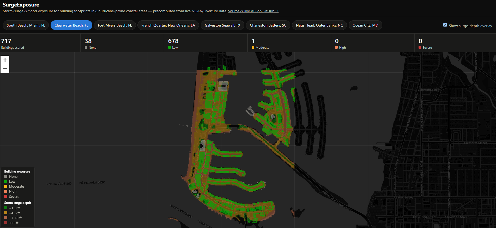

# SurgeExposure — Storm-Surge & Flood Exposure Pipeline for Utility/Property Assets



## Description
A reproducible data-engineering pipeline that ingests NOAA National Storm Surge Risk
(MEOW/MOM) layers and NOAA NWPS flood-inundation polygons, overlays them against
building/infrastructure footprints from Overture Maps (GeoParquet), and produces
per-asset exposure scores plus an interactive map and an API endpoint. Optionally
enriched with FEMA NFIP claims to show historical loss.

## Why it stands out
Combines flood-hazard/FEMA research background with cloud-native geospatial (GeoParquet +
DuckDB + Overture GERS IDs) and a real utility/insurance use case (which assets are
surge-exposed). It's a pipeline, not a notebook, and mirrors what an insurer or utility
risk team actually needs. Florida (FPL territory) is the ideal demo region.

## Open data
- NOAA National Storm Surge Risk Maps
- NOAA NWPS flood-inundation API
- Overture Maps buildings/infrastructure
- FEMA NFIP redacted claims

## Tech stack
Python, DuckDB spatial (query Overture GeoParquet directly on S3), GeoPandas, FastAPI,
PostGIS for persistence, leafmap/deck.gl for the map, AWS deployment.

## Status
Working MVP. Demo region: a coastal strip of Miami-Dade County (FPL/South
Florida service territory), configurable via `bbox` query params.

## Setup
```bash
python3.11 -m venv .venv && source .venv/bin/activate
pip install -e ".[dev]"

# One-time ~1.6GB download of the NOAA SLOSH MOM storm-surge raster, cached
# in data/raw/ (only needs to run once):
python -m surge_exposure.data.storm_surge
```

## Run
```bash
# API + interactive map
uvicorn surge_exposure.api.main:app --reload
# then visit:
#   http://127.0.0.1:8000/exposure?bbox=-80.20,25.70,-80.10,25.80  (GeoJSON)
#   http://127.0.0.1:8000/map?bbox=-80.20,25.70,-80.10,25.80       (Folium map)

# Or run the pipeline directly and persist to DuckDB:
python -m surge_exposure.pipeline
```

## Run with Docker
```bash
docker compose up --build
# then, once, fetch the storm-surge raster into the persisted volume:
docker compose exec app python -m surge_exposure.data.storm_surge

# visit http://127.0.0.1:8000/exposure?bbox=... or /map?bbox=...
```
The storm-surge raster is fetched lazily into a named volume (`surge-data`)
rather than baked into the image, so it survives container rebuilds and
doesn't bloat the image. Requires Docker Desktop (or another Docker
engine) installed locally.

## Architecture
- `data/overture.py` — Overture Maps building footprints, queried live via
  DuckDB spatial + httpfs directly against S3 GeoParquet (release resolved
  dynamically from Overture's STAC catalog, bbox pushdown via the `bbox`
  struct column — no local download).
- `data/nwps.py` — NOAA NWPS gauge client (`api.water.noaa.gov/nwps/v1`).
- `data/flood_inundation.py` — live NWM analysis-and-assimilation flood
  inundation extent polygons from NOAA's HydroVIS ArcGIS services
  (`maps.water.noaa.gov`), updated hourly.
- `data/storm_surge.py` — NOAA SLOSH MOM storm-surge raster (cached locally
  once, ~1.6GB), sampled at building centroids.
- `pipeline.py` — overlays the three hazard layers into a 0-1
  `exposure_score` per building (60% storm-surge depth, 40% active flood
  intersection) and an `exposure_category` (none/low/moderate/high/severe).
- `api/` — FastAPI endpoints (`/exposure` GeoJSON, `/map` Folium HTML).

## Tests
```bash
pytest tests/
```
Unit tests validate the scoring/categorization logic and raster-sampling
against synthetic data — they don't hit live NOAA/Overture services, so
they run fast and offline.

## Live demo
A static, precomputed showcase (8 coastal regions, no live backend) is
published via GitHub Pages: https://dbishal13.github.io/surge-exposure/
See `scripts/precompute_regions.py` and `docs/`.

## Caching
`/exposure` and `/map` cache scored results to disk
(`data/cache/exposure/`, keyed by bbox + limit, 6h TTL) so a cold request
is still ~35-40s (dominated by the live Overture GeoParquet scan) but a
repeat request for the same area is ~60ms. See `api/cache.py`.

## Validation against real losses
`exposure_score` is currently a fixed, explainable heuristic (60% surge
depth + 40% active flood intersection, see `pipeline.py`) — not calibrated
against real outcomes. This project includes a full validation study
against real FEMA NFIP claims for Lee County, FL (Fort Myers Beach,
Sanibel, Cape Coral — hit directly by Hurricane Ian's 2022 surge), written
up with a literature review, methodology, and results in
**[paper/](paper/)** — see [paper/paper.md](paper/paper.md) for the full
report, [paper/figures/](paper/figures/) for charts, and
[paper/data/](paper/data/) for the underlying per-cell CSV.

FEMA rounds NFIP claim coordinates to 1 decimal degree (~11km) before
publishing, for privacy — coarser than this project's building-level
scores, so the comparison can't be per-building. Instead both sides are
snapped to that same 0.1° grid and aggregated per cell before comparing.
Run it yourself (needs the SLOSH raster cached, see Setup, and live
network access):
```bash
python scripts/validate_exposure_bins.py
```
It prints the per-cell table plus Pearson correlation between mean
exposure score and (a) claim count and (b) mean amount paid per cell, and
writes the table to `paper/data/lee_county_grid.csv`. Regenerate the
chart below from that CSV with `python scripts/plot_validation_chart.py`.

<picture>
  <source media="(prefers-color-scheme: dark)" srcset="paper/figures/validation-chart-dark.png">
  
</picture>

**See [paper/paper.md](paper/paper.md) §6 for the current results and
§8 for limitations** — a prior version of this validation under-sampled
buildings outside one coastal strip (a query-ordering bug, documented in
the paper) and has since been re-run with a fixed, county-wide per-cell
sampling method. A real recalibration of the 60/40 split should wait for
a multi-county run with more overlapping cells.

## Next steps
- Recalibrate the exposure weights against observed NFIP losses, informed
  by the validation above (see it for current findings/limitations).
- Persist scored results to PostGIS instead of (or alongside) DuckDB for
  multi-user access.
- Deploy the live Docker image (not just the static showcase) to a
  publicly reachable demo URL (Render/AWS).
