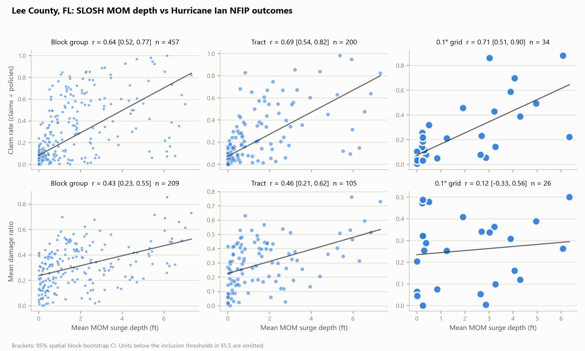
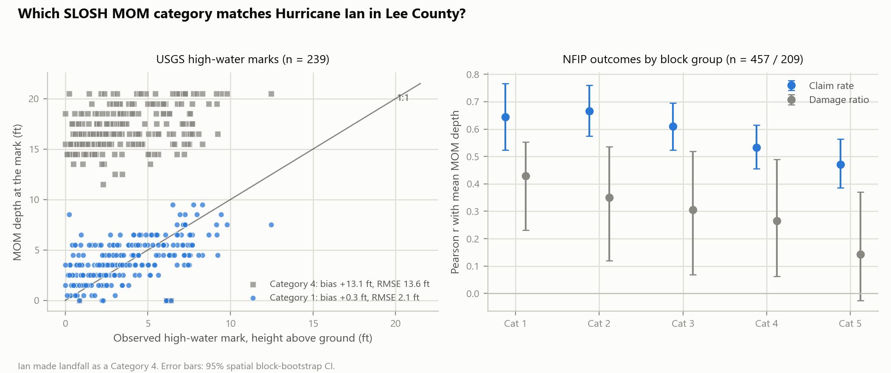

# How Well Does a Worst-Case Storm-Surge Envelope Track Insured Losses? NOAA SLOSH MOM versus Hurricane Ian NFIP Claims at Block-Group, Tract and Grid Scale

**Status:** working paper, not peer-reviewed. Produced with the open-source
[SurgeExposure](../README.md) pipeline, which serves here as the
measurement instrument, not as the object being validated (§2). The main
results are the census-unit analysis in §5.5 and §6.2. The original
0.1°-grid analysis (§5.1–§5.4, §6, §6.1) is kept because several of its
conclusions reverse at finer scale, and that reversal is itself a finding
(§7). Read the limitations (§8), especially selection bias, before
relying on any number here.

---

## Abstract

Public storm-surge hazard layers are widely used as building-level exposure
proxies, but they are rarely checked in public against what storms actually
did. We test the most widely used of them, NOAA's SLOSH Maximum of Maximums
(MOM) worst-case inundation envelope, against FEMA National Flood Insurance
Program (NFIP) claims from Hurricane Ian (2022) in Lee County, Florida. The
open SurgeExposure pipeline samples the Category 1, high-tide MOM depth at
the centroid of all
366,764 Overture building footprints in the county. We aggregate to 2020
census block groups (457 usable units), tracts (200) and a 0.1° grid (34).
Claims attributed to Ian by FEMA's event designation (28,616) are divided by
the 134,046 NFIP policies in force at landfall. Severity is measured as the
building damage ratio rather than dollars paid. Mean MOM depth tracks the
claim rate strongly at every scale (block group: Pearson *r* = 0.64,
spatial-bootstrap 95% CI 0.52–0.77; Spearman ρ = 0.78). It tracks the
damage ratio moderately at block-group and tract scale (*r* = 0.43
[0.23, 0.55] and 0.46 [0.21, 0.62]) but not on the 0.1° grid (*r* = 0.12,
CI spanning zero). Three conclusions of our earlier grid-only analysis do
not survive. Frequency looked weak only because raw claim counts mix hazard
with how many buildings are insured (grid *r* = 0.24 for counts, 0.71 for
rates). Severity, previously the stronger result, is the scale-sensitive
one. The share of claims in units with negligible modeled surge falls from
36% on the grid to 18% at block-group level, so the earlier finding that
"a third of claims were inland" was partly an aggregation artifact. The
relationship is much weaker outside the Special Flood Hazard Area, where
insurance is voluntary (block-group ρ = 0.32, vs 0.73 inside). Regression
residuals remain spatially autocorrelated (Moran's *I* ≈ 0.4). Because
insured buildings are a self-selected sample, these are statements about
insured losses, not about all damage. Ian made landfall as a Category 4,
so we repeat the analysis with every MOM category and add 239 USGS
high-water marks. The Category 1 envelope matches Ian's observed water
best (mean bias +0.3 ft, RMSE 2.1 ft), and it also matches the losses
best. The Category 4 envelope overpredicts observed water by 13 ft, and
its correlation with the damage ratio falls to 0.27. A category's MOM is
a worst case over hundreds of hypothetical storms, so matching it to the
real storm's category overstates surge. Replacing MOM with an observed
depth surface interpolated from the marks barely changes the loss
correlations (damage ratio *r* 0.43 vs 0.39 on the same units), so the
limit on predicting severity is depth itself, not the surge map. All data,
code and per-unit tables are public.

## 1. Introduction

### 1.1 Motivation

A growing number of open-source and consumer-facing tools — including this
project — compute a per-building "exposure score" or "risk score" from
publicly available hazard layers (storm-surge rasters, flood-zone maps,
inundation extents) without ever checking the score against what actually
happened to real buildings in a real storm. That is a reasonable MVP
shortcut for a demo, but it leaves an open question every such tool
inherits silently: **does the score mean anything?**

At the same time, the systems that *do* validate rigorously — First Street
Foundation's Flood Factor, Fathom Global's Risk Scores, FEMA's own Risk
Rating 2.0 — are closed: proprietary models, licensed data, and validation
claims that are asserted ("peer-reviewed," "validated against historic
flood reports") but not independently reproducible by a reader (§3.1). There
is a gap between "open but unvalidated" and "validated but closed." This
project sits in the first category by default; this report is an attempt to
narrow that gap without pretending to close it — SurgeExposure will not
match a commercial catastrophe model's rigor, but it can be honest, public,
and checked.

### 1.2 Contributions

1. **A public, end-to-end test of SLOSH MOM as an exposure proxy** (§5.5,
   §6.2), using real NFIP claims for a severe surge event. Claims are
   normalized by policies in force and severity by property value, and
   results are reported at three areal units with spatial-bootstrap
   confidence intervals.
2. **Evidence that scale and normalization change the answer** (§6.2,
   §7). Moving from a 37-cell grid with raw counts and dollar payouts to
   census units with rates and damage ratios reverses which result looks
   robust, and shrinks the apparent inland-loss share by half. This tests
   the Modifiable Areal Unit Problem (§3.6) directly, rather than only
   citing it as a caveat.
3. **A stratified look at selection** (§6.2, §8). Results are split by
   flood-zone status (inside vs outside the SFHA) and by insurance take-up,
   the bias behind the retraction discussed in §3.5.
4. **An open instrument** (§2). Building footprints, the surge raster,
   claims and policies all come from public sources, and one script
   reproduces every number (`scripts/validate_units.py`).
5. **Documented failures and fixes** (§5.3, §5.4). These are a spatially
   biased `LIMIT` sample, a timezone bug, and (§5.5) a county-code mismatch
   that silently returned zero claims. All were caught by inspecting the
   data rather than trusting a first result, and each is now covered by a
   test or an explicit check.

## 2. System Design: SurgeExposure

This section documents the system being validated, so the validation study
in §4 onward can be read against a concrete implementation rather than a
description of intent. Everything below is implemented in this repository
today; see the linked source files.

### 2.1 Architecture Overview

SurgeExposure is a Python pipeline (`pipeline.py`) fronted by a FastAPI
service (`api/`), with a small set of one-off analysis scripts (`scripts/`)
used to build a static demo and run this validation study. There is no
proprietary model and no licensed dataset anywhere in the stack:

```
data/overture.py        Overture Maps building footprints (live, S3 GeoParquet)
data/storm_surge.py      NOAA SLOSH MOM storm-surge raster (cached once, ~1.6GB)
data/flood_inundation.py NOAA NWM active flood-inundation extent (live, hourly)
data/nfip.py              FEMA OpenFEMA NFIP claims (live) -- built for this study
        |
        v
pipeline.py    -- overlays the three hazard layers into exposure_score / exposure_category
        |
        v
api/main.py (FastAPI)  -- /exposure (GeoJSON), /map (Folium), /geocode, /locations
api/cache.py             -- disk-backed cache, keyed by (bbox, limit), 6h TTL
        |
        v
Leaflet frontend (live) + static GitHub Pages showcase (8 precomputed regions)
```

### 2.2 Data Sources

- **Building footprints — Overture Maps.** Queried live via DuckDB's
  `spatial` and `httpfs` extensions directly against Overture's public
  GeoParquet on S3 (`data/overture.py`). The release version is resolved
  dynamically from Overture's STAC catalog on every query, so the pipeline
  never goes stale against a hardcoded release. Overture's `bbox` struct
  column lets DuckDB push the spatial filter down to the row-group level —
  no local download, no pre-indexing.
- **Storm-surge depth — NOAA SLOSH MOM.** The National Hurricane Center's
  "Maximum of MEOWs" composite storm-surge raster (Texas-to-Maine, 8-bit
  class resolution, ~1.6 GB zipped) is downloaded once and cached locally
  (`data/storm_surge.py`), then sampled at each building's centroid. The
  archive holds one high-tide raster per hurricane category (1–5). The
  pipeline uses **Category 1** (`settings.storm_surge_category`). Until
  October 2026 this was not a setting: the download step took the first
  GeoTIFF in the archive, which a CRC check confirms is Category 1. §6.3
  compares all five. MOM is
  a *worst-case envelope across many modeled hypothetical storms*, not a
  reconstruction of any specific real event — a distinction that matters
  for how §6's results should be read (a claim asking "did this exact
  storm's surge match the score" would need a different, event-specific
  SLOSH product; see §9).
- **Active flood extent — NOAA NWM.** Live, hourly-updated
  analysis-and-assimilation flood-inundation-mapping polygons from NOAA's
  HydroVIS ArcGIS services (`data/flood_inundation.py`), intersected against
  building footprints. This is a *current-conditions* feed — `get_inundation_extent`
  takes no date parameter and queries whatever is flooded right now — with
  no historical replay capability in this codebase. It can in principle
  register riverine/pluvial flooding as well as coastal, but only if that
  flooding is happening at query time; a fact that matters directly for §6,
  where this study's query (mid-2026) necessarily returned zero active
  extent for a 2022 storm.
- **Ground truth for validation — FEMA NFIP claims.** Built specifically for
  this study (`data/nfip.py`): a client for FEMA's OpenFEMA NFIP claims API
  (v3), described fully in §5.

### 2.3 The Exposure Scoring Model

The scoring formula (`pipeline.py`) is deliberately simple and legible
rather than fit to data:

```
exposure_score = 0.6 * min(surge_ft, 20) / 20 + 0.4 * flood_active
```

mapped to five categories by fixed thresholds: `severe` (≥0.75), `high`
(≥0.5), `moderate` (≥0.25), `low` (>0), `none` (0). The 60/40 weighting and
the thresholds were chosen for explainability — a reader can reconstruct a
building's score from its two inputs without a model card — not calibrated
against any outcome data. That is precisely the gap this report's
validation study probes.

### 2.4 Serving Layer: API, Caching, and Latency

The FastAPI service (`api/main.py`) exposes `/exposure` (GeoJSON) and `/map`
(a server-rendered Folium map), plus `/geocode` (free-text place lookup via
OpenStreetMap Nominatim) and `/locations` (hand-picked demo presets). A
live query is dominated by the Overture GeoParquet scan (~35-40s cold); a
disk-backed cache keyed by `(bbox, limit)` with a 6-hour TTL (`api/cache.py`)
brings a repeat request for the same area down to ~60ms. The TTL is a
deliberate trade: NWM flood extent updates hourly, but this is a
demonstration system, not an operational one, so a few hours of staleness
is an acceptable price for not re-running a 35-40s query on every repeat
visit — an explicit design decision, not an oversight (see the comment in
`api/cache.py`).

### 2.5 Frontend: Interactive Map and Static Showcase

Two frontends exist, deliberately serving different purposes:

1. **The live app** (`api/static/index.html`) — search any address, hit the
   live API, see buildings colored by exposure category on a Leaflet map.
   Meant for local/self-hosted use given the live backend it depends on.
2. **A static GitHub Pages showcase** (`docs/`) — eight hurricane-prone
   coastal regions (South Beach Miami, Fort Myers Beach, French Quarter New
   Orleans, Galveston Seawall, and others) precomputed once
   (`scripts/precompute_regions.py`) into static GeoJSON + a colorized
   surge-depth PNG overlay per region, requiring no backend at all. This is
   the version most viewers actually reach, since it needs no
   infrastructure to host.

### 2.6 Deployment

A Docker image exists (`Dockerfile`, `docker-compose.yml`) for the live
API. The 1.6GB SLOSH raster is fetched lazily into a named volume rather
than baked into the image, so it survives container rebuilds without
bloating image size or requiring it at build time.

### 2.7 Testing Philosophy

Unit tests (`tests/`) validate the scoring/categorization logic and
raster-sampling against synthetic data with all live network calls mocked
via `monkeypatch` — they run fast and offline, and are the tests that ran
green throughout this study's development (§5.3's bug was *not* caught by
these tests, since they test the scoring math, not the live Overture query
behavior — a limitation of the test suite worth naming plainly rather than
implying the tests would have caught it).

## 3. Related Work

### 3.1 Commercial and Institutional Flood Risk Scoring Systems

SurgeExposure is not the first system to compute a property-level flood
risk score. It differs from the systems below primarily in *openness*, not
in modeling sophistication — these are professionally built and, by their
own account, validated at a scale this report cannot match (§8).

| System | Access | Core data | Output | Validation disclosure |
|---|---|---|---|---|
| **SurgeExposure** (this project) | Open source, free, self-hostable | Overture Maps, NOAA SLOSH, NOAA NWM | Building-level 0-1 score, 5 categories | This report — full methodology and code public |
| **First Street Foundation Flood Factor** | Free lookup (consumer), licensed bulk data | USGS DEMs/NED, proprietary flood model, "80+ experts" | Property-level 1-10 score | Asserted peer-reviewed basis; underlying validation code/data not public |
| **FEMA Risk Rating 2.0** | Public methodology PDF; used internally for NFIP pricing | FEMA mapping + commercial catastrophe models, building characteristics | Per-policy premium, not an exposed public "score" | Methodology document public; underlying commercial model internals are not |
| **Fathom Global Risk Scores** | Commercial/institutional (API, portal) | Fathom Global Flood Map (fluvial/pluvial/coastal) | 0-1,000,000 relative risk *or* 0-100 category | Claims peer-reviewed academic basis; specific validation datasets not public |

The pattern across the three commercial/institutional systems: real
scientific grounding is claimed, but the validation itself — the actual
comparison against observed losses, with numbers a reader can check — is
not published in a form an outside reader can reproduce. SurgeExposure is
strictly less sophisticated than any of these (§8), but §4 onward is an
attempt to make the *validation itself*, not just the score, fully public.

### 3.2 Storm-Surge Model Validation

NOAA's SLOSH (Sea, Lake, and Overland Surges from Hurricanes) model, the
surge layer this project uses, has itself been validated against observed
high-water marks in post-storm studies; NOAA reports roughly 20% error for
significant surges, with better accuracy above ~12-13 ft of surge ([NOAA
National Hurricane Center, Storm Surge Unit](https://www.nhc.noaa.gov/surge/ssu.php);
[NOAA National Storm Surge Risk Maps v4](https://www.nhc.noaa.gov/nationalsurge/)).
That validation is against *surge itself* (a physical quantity) — it says
nothing about how well a downstream *exposure heuristic built on top of*
SLOSH tracks *financial loss*, which is the question §4 asks.

### 3.3 NFIP Claims as a Research Resource

FEMA's public release of ~2.5 million redacted NFIP claims (from 1970
onward) opened claims-level flood research to outside researchers ([Journal
of Real Estate Literature overview](https://www.tandfonline.com/doi/abs/10.1080/09277544.2021.1876435)).
Shin, Cocke & Kim (2022) audited NFIP claims hazard fields for Florida
specifically and found the "cause of loss" and event-attribution fields are
frequently incomplete or wrong, requiring correction against independent
storm-track data (HURDAT2) before the claims data can be trusted for hazard
attribution ([*Applied Sciences* 12(7), 3537](https://www.mdpi.com/2076-3417/12/7/3537)).
This study does *not* perform that correction — claims are used as raw
counts/payouts within a county and time period, not attributed to a
specific storm beyond what `dateOfLoss` implies — which is one more reason
to read §6's numbers as directional (§8).

### 3.4 Depth-Damage Functions and Loss Modeling Limits

Wing, Pinter, Bates & Kousky (2020), analyzing ~2 million NFIP claims,
found that **observed flood losses are not a simple monotonic function of
inundation depth** — the standard federal depth-damage curves performed so
poorly that a flat mean damage value predicted losses better than the
curves, and vulnerability varied substantially by geography and building
vintage ([*Nature Communications* 11, 1444](https://doi.org/10.1038/s41467-020-15264-2)).
This matters directly for §2.3's scoring formula: if depth alone is a weak
predictor of loss *magnitude* nationally, a heuristic that leans 60% on
depth should not be assumed to predict severity well either — it has to be
checked, which is exactly what §4-§6 do.

### 3.5 Catastrophe Model Validation Methodology

Public, reproducible comparisons of flood loss models against observed
claims are scarce. The most prominent recent one, a comparison of seven
commercial and federal flood catastrophe models against NFIP claims by
Dusseau, Zobel & Schwalm in the *Journal of Catastrophe Risk and
Resilience* 4(1), was **retracted by its authors on 16 September 2026**
([retraction note](https://journalofcrr.com/Comment/Retraction-Note-04-08-Dusseau-et-al/)).
They cite a data error in one table and a methodological flaw: the
comparison "did not adequately account for the low insurance take-up rate
and the resulting risk selection bias within the NFIP dataset." Its findings
are not relied on here. The stated flaw applies to any study that treats
NFIP claims as ground truth, this one included: claims only exist where
someone bought a policy, and take-up varies across space. §5 therefore
normalizes claim counts by policies in force, and §8 discusses the
selection bias that normalization cannot remove.

Most published validation of US flood hazard models is against maps or
other models, not claims. Bates et al. (2021) validated the national
fluvial, pluvial and coastal model behind First Street's Flood Factor
against high-quality local models and FEMA's 1%-annual-chance maps
(Critical Success Index 0.69–0.82). Studies that do use NFIP claims as
the reference have mostly asked a different question: where losses fall
relative to the mapped floodplain. Around Houston, the 100-year floodplain
proved neither accurate nor sufficient as a risk metric, with substantial
losses outside it (Highfield, Norman & Brody, 2013; Blessing, Sebastian &
Brody, 2017). Other studies use claims as training labels rather than as
an independent test, as in Mobley et al.'s (2021) random-forest flood
probability map for southeast Texas. The scarcity of
public, checkable validation is part of the motivation for this report:
§4-§6 compare a model score against real claims at a much smaller scale
(one county, one event), with every input, script and intermediate table
public.

### 3.6 Spatial Aggregation and the Modifiable Areal Unit Problem

NFIP claim coordinates are rounded to 0.1° before release, but claims and
policies also carry a census block-group code. Any comparison is therefore
still an *ecological correlation*, but it can be made at block-group,
tract or grid scale, and §6.2 reports all three. Any such comparison is — a
relationship between area-aggregated quantities, not individual buildings.
This is a textbook instance of the Modifiable Areal Unit Problem (MAUP):
statistical relationships computed over arbitrarily-drawn areal units can
shift, and sometimes reverse, under a different unit size or boundary
placement (Openshaw, 1984; overview in [ScienceDirect: Modifiable Areal Unit
Problem](https://www.sciencedirect.com/topics/earth-and-planetary-sciences/modifiable-areal-unit-problem)).
An ecological correlation is not proof of an individual-level relationship
— this is the single most important methodological caveat for everything in
§6.

## 4. Research Question

> **RQ:** Across areal units in Lee County, FL, does mean SLOSH MOM surge
> depth at building centroids correlate with Hurricane Ian's insured
> losses, and does the answer depend on the unit of aggregation?

- **H1 (frequency):** mean MOM depth per unit is positively correlated with
  the Ian *claim rate*, i.e. claims ÷ NFIP policies in force at landfall.
- **H2 (severity):** mean MOM depth per unit is positively correlated with
  the mean building *damage ratio*, i.e. damage ÷ property value.
- **H3 (scale):** the H1 and H2 correlations are similar at block-group,
  tract and 0.1°-grid scale.
- **Exploratory:** the H1 relationship inside vs outside the SFHA, and
  across terciles of insurance take-up.

The original analysis (§5.1–§5.4, §6, §6.1) tested earlier versions of H1
and H2. Those used raw claim counts and mean dollar payouts against the
pipeline's `exposure_score`, on the 0.1° grid only. Because the score's
flood-extent term was inert (§6), that score equals 0.03 × MOM depth
(capped at 20 ft). The two analyses therefore measure the same hazard
input, and differ only in units, normalization and inference.

## 5. Validation Methodology

**Study area.** Lee County, FL (FEMA county code `12071`) — Fort Myers
Beach, Sanibel, Cape Coral, Fort Myers — struck directly by Hurricane Ian's
storm surge in September 2022.

**Exposure scores.** Computed by the pipeline described in §2.2-§2.3.

**Claims.** Fetched live from FEMA's OpenFEMA NFIP claims API (v3,
`fema.gov/api/open/v3/NfipClaims`), filtered to `state='FL'` and
`countyCode='12071'`, all available years (`data/nfip.py`). A small number
of claims (12 of 48,119, ~0.02%) carry coordinates well outside any
plausible Lee County location (e.g. latitude 29.4°, off the Florida
panhandle) and are dropped as mis-coded records before analysis —
consistent with the data-quality issues Shin et al. (2022) document for
this exact dataset (§3.3).

**Grid-cell join.** Both sides are snapped to a 0.1° lat/lon grid (matching
NFIP's own privacy rounding) and aggregated per cell: mean `exposure_score`
and building count on one side, claim count and mean claim payout
(building + contents, net of the small number of null payout fields) on the
other. Cells are joined with an inner join — only cells with *both* scored
buildings and claims contribute to the correlation.

**5.3 Building sampling — and a bug worth documenting.** An earlier version
of this script queried buildings once, over the whole county bounding box,
with a flat row-count cap (`LIMIT 5000`, no `ORDER BY`). That returned only
5 overlapping grid cells, and inspection showed why: DuckDB's scan order
over Overture's partitioned GeoParquet is not spatially uniform, so the
first 5,000 matching rows all came from one coastal strip, never reaching
the rest of the county. The county's true extent (derived from the claims
data itself, after outlier filtering) contains **~420,000** buildings — too
many to score in full for a validation script — so the fixed version
queries buildings **per claim grid-cell**: a small 0.1°×0.1° Overture query,
capped at 500 buildings, run once for each of the county's claim-bearing
grid cells (37 cells after outlier filtering). This bounds total work while
guaranteeing every claim cell gets a fair chance at building coverage. (See
`scripts/validate_exposure_bins.py` and its git history for the
before/after.)

**Statistic.** Pearson correlation coefficient (`numpy.corrcoef`) between
mean exposure score and each of claim count / mean payout, across
overlapping grid cells. No significance test is reported — see §8 on why
one would be misleading at this *n*.

**Reproducibility.** Every input is public and the pipeline is fully
scripted: `python scripts/validate_exposure_bins.py` reproduces §6 end to
end (requires the cached SLOSH raster and live network access — see the
main [README](../README.md#setup)).

**5.4 Sensitivity check: restricting claims to Ian's own date window.** The
main run above (§6) uses *all* available years of Lee County NFIP claims —
1978 to the query date — not just claims attributable to Ian. That was a
disclosed limitation (§8, original Limitation 5), not a fixed one: any
grid cell's claim count could be inflated by unrelated flood events sharing
that cell, with no way to tell from the headline number alone how much this
mattered. `scripts/validate_exposure_bins.py --ian-window` closes that gap
by re-running the identical pipeline with one change: claims are filtered
to `dateOfLoss` within **2022-08-31 to 2022-12-31** (four weeks before
Ian's 2022-09-28 landfall, through a three-month claims-filing tail) before
aggregation. Building exposure scores are unaffected by this filter --
buildings don't have a "date of loss" -- so any change in the correlations
below isolates the effect of the claims-side date restriction specifically.
Output goes to a separate file (`paper/data/lee_county_grid_ian_window.csv`)
so the original, unrestricted run is preserved for comparison rather than
overwritten.

*A second real bug, caught the same way as the first (§5.3): trust the
run, not the first result.* The first attempt at this filter crashed
outright -- `TypeError: Cannot compare tz-naive and tz-aware datetime-like
objects`. FEMA's live API returns `dateOfLoss` as a timezone-aware
timestamp; the filter's window bounds were naive `Timestamp` objects with
no timezone at all, and pandas correctly refuses to compare the two rather
than silently guessing. Fixed by normalizing every parsed `dateOfLoss` to
UTC and then dropping its timezone before comparison
(`scripts/validate_exposure_bins.py::_restrict_to_ian_window`), and a
regression test now reproduces the exact tz-aware timestamp shape the live
API returns (`tests/test_validate_exposure_bins.py`) so this can't
silently regress. Named here for the same reason §5.3 is: a bug that
would have either crashed obviously (as it did) or, worse, silently
produced a wrong window if the comparison had failed open instead of
raising.

**5.5 Unit-level analysis (main analysis).** `scripts/validate_units.py`
replaces the per-cell sampling of §5.3 with full coverage, and the counts
and dollars of §5.1 with rates and ratios. The steps are as follows.

- **Buildings.** All 366,764 Overture footprints inside Lee County's 2020
  block groups are reduced to centroids, and Category 1 high-tide MOM depth (§2.2,
  §6.3) is sampled at each centroid. Depth is the midpoint of NOAA's 1-ft class bin. Outside MOM
  coverage, depth is 0. Each unit's exposure is the mean depth over its
  buildings, and the share of buildings with depth above 0 is recorded
  alongside it.
- **Claims.** OpenFEMA NFIP claims (v3) are filtered server-side to
  `countyCode = '12071'` and `eventDesignationNumber = 'FL0222'` (Ian). This
  gives 28,616 claims, and 28,541 (99.7%) carry a usable block-group code
  (`censusGeoid`). FEMA's codes mix 2010 and 2020 census vintages. Each
  2010-only code (214 of them) is mapped to the 2020 block group it
  overlaps most by area.
  - The first run of this script returned zero claims because it passed
    the 3-digit county code (`071`) instead of the 5-digit FIPS code the
    API filters on. The script now raises an error on an empty result
    rather than continuing.
- **Policies.** OpenFEMA FIMA NFIP Redacted Policies (v2), selecting
  policies in force on 28 Sept 2022, i.e. effective on or before landfall
  and terminating after it. `policyCount` is summed per unit: 134,046
  policies in total, 99.96% with a usable block-group code.
- **Metrics.**
  - *Claim rate* = Ian claims ÷ policies in force.
  - *Damage ratio* = `buildingDamageAmount` ÷ `buildingPropertyValue`,
    capped at 1. Claims with missing or zero value are excluded, leaving
    21,307. Mean dollar payout (building plus contents) is kept as a
    secondary measure.
  - *Take-up* = policies ÷ building footprints. This is only a proxy: it
    exceeds 1 in 70 block groups, where individual condominium-unit
    policies outnumber footprints, so it is used only to form terciles.
  - *SFHA*: rated flood zones beginning with A or V. Claim rates are
    computed separately inside and outside it.
- **Inclusion.** A unit enters the H1 analysis with at least 20 policies
  and 50 buildings, and the H2 analysis additionally needs at least 5
  claims with a damage ratio. The tract and grid units are built by
  truncating the block-group code (tract) or rounding claim and building
  coordinates to 0.1° (grid).
- **Inference.**
  - Both Pearson *r* and Spearman ρ are reported.
  - 95% CIs come from a spatial block bootstrap with 2,000 replicates. It
    resamples whole 0.1° blocks, or 0.2° blocks for the grid unit, so that
    neighbouring units are not treated as independent.
  - Moran's *I* of the residuals from a linear fit uses 8-nearest-neighbour
    row-standardized weights and 999 permutations.
  - Naive *p*-values are saved in `results.json` but not interpreted.
- **Outputs.** `paper/data/units/{block_group,tract,grid}.csv` and
  `results.json`.

## 6. Results

*This section and §6.1 report the original grid analysis, kept for
comparison with §6.2. Its per-cell building sample was the first 500 rows
DuckDB returned for each cell, not a random sample. That is the same bias
as §5.3, at a smaller scale. The script now samples randomly with a fixed
seed (`overture.limit_clause`). All numbers below were regenerated with
that random sample on 2026-10-01, with the live flood feed switched off
(§6, last paragraph). Correlations moved by 0.03–0.04 and no conclusion of
this section changed. §6.2 scores every building and does not depend on
sampling.*

The per-cell run scored **18,042 buildings** across **37 grid cells**
covering essentially all of Lee County, and matched them against **48,107**
NFIP claims (after outlier filtering, §5) in those same 37 cells — full
county-wide overlap, unlike the 5-cell overlap the flawed first pass
produced (§5.3). Full per-cell data: [`paper/data/lee_county_grid.csv`](data/lee_county_grid.csv).

<picture>
  <source media="(prefers-color-scheme: dark)" srcset="figures/validation-chart-dark.png">
  
</picture>

**H1 (claim frequency):** mean `exposure_score` correlated with claim count
at **r = 0.35** — a real but modest positive relationship, somewhat stronger than
the r = 0.20 the flawed 5-cell pass found. That pass's severity
correlation of r = 0.81 (§5.3) turned out to be far too optimistic.

**H2 (claim severity):** mean `exposure_score` correlated with mean claim
payout at **r = 0.49** — moderate, and, as with H1, higher than the
frequency correlation but by a much smaller margin than the first pass
implied. Both hypotheses are supported directionally; neither is a strong
relationship.

**The more informative pattern was spatial, not statistical.** Splitting
the county's cells at roughly the coastline (lon ≤ -82.0° vs. lon > -82.0°):
coastal cells average a mean exposure score of **0.068**, inland cells
**0.027** — the score correctly recognizes the coast as more exposed, by a
factor of ~2. But claim volume does not track that split: coastal cells
account for 22,350 claims, inland cells **25,757** — Lee County's *interior*
generated more claims than its scored-as-riskier coastline. Roughly **30%
of all claims (15,492 of 48,107, 32%) sit in cells with a mean exposure score
below 0.02** — near the pipeline's effective floor — concentrated in the
county's eastern cells (grid longitude -81.6 to -81.9, inland Fort Myers
and Lehigh Acres). The highest-scoring cell in the dataset (26.4°N,
-81.9°W, score 0.191) sits at the coastal/inland boundary and does carry
substantial claims (4,763) — but several purely inland cells (e.g. 26.6°N,
-82.0°W: score 0.008, 4,619 claims; 26.6°N, -81.9°W: score 0.007, 3,375
claims) carry comparable claim volume with a score indistinguishable from
zero.

**One more fact changes how to read all of the above: the active-flood term
contributed nothing in this run.** In the original run, querying
`data/flood_inundation.py`'s live NWM feed for the full county extent, in
mid-2026, returned zero active inundation polygons — expected, since Lee County is not presently flooding
and the feed has no historical replay capability (§2.2). That means
`flood_active` was `False` for every building scored
here, and every `exposure_score` in this study reduces exactly to its
surge term: `0.6 * min(surge_ft, 20) / 20`. §6's correlations are therefore
correlations against **SLOSH surge depth alone**, not against the full
60/40 formula — the 40% flood-extent weight was structurally inert for
this entire validation, through no fault of the buildings scored. The
regenerated run therefore switches the live feed off explicitly
(`run_exposure_pipeline(..., live_flood=False)`). This gives the same
scores without depending on a service that was returning server errors,
or letting present-day flooding leak into a 2022 validation.

**6.1 Sensitivity check: restricting claims to Ian's own date window (§5.4).**
Filtering `dateOfLoss` to 2022-08-31–2022-12-31 dropped **19,292 of 48,119
claims (40%)** — a far larger share than the disclosed-but-unquantified
Limitation 5 in the original draft implied. Three grid cells lost all
their claims entirely and dropped out (37 → 34 overlapping cells); the
remaining **16,543 scored buildings** matched against **28,816** real,
Ian-window-only claims. The two hypotheses did *not* respond the same way:

| | Unrestricted (all years, §6) | Ian window only (§6.1) | Change |
|---|---|---|---|
| Claims used | 48,107 | 28,816 | -40% |
| Grid cells | 37 | 34 | -3 |
| H1: r(score, claim count) | 0.35 | **0.21** | -0.14 |
| H2: r(score, mean payout) | 0.49 | **0.49** | 0.000, unchanged |

**H1's correlation is not robust to this check; H2's is.** Restricting to
claims plausibly caused by Ian weakens the frequency relationship by about
about 40% (0.35 → 0.21) while leaving the severity relationship untouched.
The natural read: **large-dollar claims cluster tightly with real,
identifiable storm events almost regardless of which storm** (a
catastrophic payout in Lee County is unlikely to come from routine,
non-storm flooding, so restricting to Ian's window removes few *severe*
claims specifically), while a substantial share of *routine, low-dollar*
claims recorded over 1978–2026 are unrelated background noise that happens
to weakly echo the same coastal-vs-inland geography the score also
encodes — inflating H1's unrestricted correlation without reflecting
anything about Ian, or about `exposure_score`'s real skill, specifically.
Full per-cell data: [`paper/data/lee_county_grid_ian_window.csv`](data/lee_county_grid_ian_window.csv).

**6.2 Unit-level results (main results, §5.5).**

<picture>
  <source media="(prefers-color-scheme: dark)" srcset="figures/units-chart-dark.png">
  
</picture>

| | Block group | Tract | 0.1° grid |
|---|---|---|---|
| Units used / total | 457 / 578 | 200 / 222 | 34 / 39 |
| **H1** claim rate, *r* [95% CI] | **0.64** [0.52, 0.77] | **0.69** [0.54, 0.82] | **0.71** [0.51, 0.90] |
| H1 claim rate, ρ [95% CI] | 0.78 [0.73, 0.83] | 0.80 [0.73, 0.85] | 0.83 [0.64, 0.91] |
| Raw claim count, *r* (for comparison) | 0.66 | 0.64 | 0.24 [−0.06, 0.75] |
| **H2** damage ratio, *r* [95% CI] (units) | **0.43** [0.23, 0.55] (209) | **0.46** [0.21, 0.62] (105) | 0.12 [−0.33, 0.56] (26) |
| H2 damage ratio, ρ | 0.43 | 0.45 | 0.16 |
| Mean payout USD, *r* (secondary) | 0.50 | 0.54 | 0.37 [−0.33, 0.77] |
| Claim rate inside SFHA, ρ [95% CI] | 0.73 [0.63, 0.82] | 0.77 [0.66, 0.84] | 0.74 [0.52, 0.86] |
| Claim rate outside SFHA, ρ [95% CI] | 0.32 [0.17, 0.46] | 0.46 [0.30, 0.61] | 0.72 [0.46, 0.94] |
| Residual Moran's *I*, claim rate (*p*) | 0.39 (0.001) | 0.28 (0.001) | 0.12 (0.03) |

**H1 is supported at every scale.** Once claims are divided by policies in
force, mean MOM depth tracks Ian's claim rate strongly at all three units,
with confidence intervals well clear of zero. The weak grid-level frequency
result of §6 (*r* = 0.35, or 0.21 in Ian's window) came from counting
claims rather than rating them. Raw counts on the grid still correlate only
at *r* = 0.24 in this run, because a 0.1° cell's claim count mostly
reflects how many insured buildings it contains.

**H2 is supported at block-group and tract scale but not on the grid.**
Damage ratios rise with MOM depth (*r* ≈ 0.45) once units are fine enough
to separate surge-flooded from dry neighbourhoods. A 0.1° cell averages
both, and the relationship disappears. Dollar payouts correlate somewhat
more strongly than damage ratios (0.50 vs 0.43 at block group), which is
consistent with part of the payout signal reflecting property value
rather than hazard (§8).

**H3 is rejected for severity and confirmed for frequency.** This is the
MAUP risk §3.6 warned about, now measured.

**Inland losses are smaller than the grid suggested.** At block-group
level, 18% of Ian claims (5,100 of 28,541) fall in units with mean MOM
depth below 0.67 ft, the depth equivalent of the "score below 0.02"
threshold in §6. Only 1.4% (411) fall in units where no building has any
modeled surge. On the grid, the equivalent share is 36%. The pattern §6
reported is real, but a 0.1° cell straddling the coast is labelled "low
exposure" while containing heavily flooded blocks, which roughly doubles
its apparent size.

**Inside vs outside the SFHA.** Nearly all Ian claims (97%) and 81% of
policies were rated inside the SFHA. Inside it, MOM depth tracks the claim
rate closely (ρ = 0.73). Outside it, the relationship is less than half as
strong at block-group level (ρ = 0.32). There, policies are voluntary and
few, and losses are less tied to coastal surge.

**Take-up.** By block-group tercile of take-up, the claim-rate correlation
is *r* = 0.81 (low), 0.78 (middle) and 0.51 (high), with Spearman ρ of
0.58, 0.80 and 0.64. High-take-up units are also the most surge-exposed
(mean depth 1.8 ft vs 0.2 ft in the low tercile), so take-up and hazard
cannot be separated here. The stratification shows that the relationship
holds in every tercile, not that it is free of selection (§8).

**Residual structure.** Residuals remain clearly clustered at fine scale
(Moran's *I* 0.28–0.44, permutation *p* = 0.001). Some spatially organized
factor that MOM depth does not capture, such as elevation, building age,
rainfall or the gap between MOM and Ian's actual surge, explains part of
the variance. The bootstrap CIs account for clustering in the
*uncertainty*. They do not remove it from the *estimate*.

**Spatially corrected inference** (`scripts/spatial_models.py`).

| | Block group, claim rate | Block group, damage ratio | Tract, claim rate | Tract, damage ratio |
|---|---|---|---|---|
| Units *n* | 457 | 209 | 200 | 105 |
| Dutilleul effective *n* | 73 | 52 | 45 | 51 |
| Dutilleul *p* | 7 × 10⁻¹⁰ | 0.002 | 2 × 10⁻⁷ | 0.001 |
| Standardized slope, OLS → spatial error model | 0.64 → 0.73 | 0.43 → 0.55 | 0.69 → 0.64 | 0.46 → 0.48 |
| Spatial error λ | 0.74 | 0.76 | 0.67 | 0.64 |

- **Modified t-test** (Clifford, Richardson & Hémon 1989; Dutilleul 1993).
  Spatial autocorrelation in both variables cuts the effective sample size
  to 45–73 independent observations, roughly a sixth of the raw count of
  units. Both relationships remain clearly significant at that reduced *n*.
- **Spatial error model.** Fitted by maximum likelihood with
  8-nearest-neighbour weights. It absorbs the residual clustering
  (λ ≈ 0.7) and leaves the depth coefficient as large as, or larger than,
  under OLS.

The clustering is real and large, but it is not producing the
relationship.

**6.3 Which MOM category? A check against USGS high-water marks.** NOAA's
national MOM download holds one high-tide raster per hurricane category.
Every number above uses Category 1 (§2.2). That was not chosen on purpose,
and Ian made landfall as a Category 4. `scripts/validate_categories.py`
therefore repeats §6.2 with each category. It also adds a check against
observed water that does not depend on insurance data: the 239 coastal
high-water marks that USGS surveyed in Lee County after Ian (STN event
325). All are of fair quality or better (±0.20 ft or less), and each
records the water's height above ground.

<picture>
  <source media="(prefers-color-scheme: dark)" srcset="figures/categories-chart-dark.png">
  
</picture>

| MOM category | Bias at marks (ft) | RMSE (ft) | *r* at marks | Marks within 1 ft | Buildings wet | Claim rate *r* [95% CI] | Damage ratio *r* [95% CI] |
|---|---|---|---|---|---|---|---|
| **1** | **+0.3** | **2.1** | **0.61** | **42%** | 23% | 0.64 [0.52, 0.77] | **0.43** [0.23, 0.55] |
| 2 | +4.2 | 4.9 | 0.49 | 8% | 43% | **0.67** [0.57, 0.76] | 0.35 [0.12, 0.54] |
| 3 | +7.7 | 8.2 | 0.42 | 0% | 62% | 0.61 [0.52, 0.70] | 0.31 [0.07, 0.52] |
| 4 (Ian) | +13.1 | 13.6 | 0.24 | 0% | 80% | 0.53 [0.45, 0.62] | 0.27 [0.06, 0.49] |
| 5 | +16.0 | 16.4 | −0.02 | 0% | 88% | 0.47 [0.39, 0.56] | 0.14 [−0.03, 0.37] |

*Bias, RMSE, r and "within 1 ft" compare MOM depth with observed height
above ground at the 239 marks. The claim and damage columns are
block-group correlations, as in §6.2 (n = 457 and 209).*

**Category 1 is the closest match to Ian on almost every measure.** At the
marks, its depth is on average only 0.3 ft above observed water (observed
mean 3.7 ft, MOM mean 4.0 ft), and 42% of marks are within 1 ft. Each
higher category overpredicts by a further 4–16 ft, and also tracks the
*pattern* of observed water less well (*r* 0.61 falling to −0.02).

The loss data agree.
- The damage-ratio correlation falls steadily from 0.43 (Category 1) to
  0.14 (Category 5).
- The claim-rate correlation is about the same for Categories 1 and 2
  (0.64 and 0.67, with overlapping CIs) and falls from Category 3 upward.
- The claim-rate relationship outside the SFHA stays weak in every
  category (ρ 0.32–0.37).

**Why a lower-category envelope fits a stronger storm.** A MOM is the
cell-by-cell maximum over hundreds of hypothetical storms of one category,
with different tracks, headings, forward speeds and landfall points. It
describes the worst case for every location at once, which no single storm
produces. Ian was one track. The Category 4 envelope assumes a Category 4
storm took the worst track for each part of the coast. It is therefore
13 ft too deep on average, and wet at 80% of the county's buildings. That
erases much of the contrast between flooded and dry neighbourhoods that the
claims respond to. In Lee County, the Category 1 envelope was the closest
stand-in for what Ian actually did.

**Caveats.**
- The marks are coastal and cover only part of the county.
- Surveyors can only find marks that survive. Water was deepest where
  structures were destroyed, and marks are least likely to survive
  there, so the observed means may understate peak water.
- This is one storm on one coastline. "A Category 1 MOM fits a Category 4
  storm" should not be generalized without other events.
- Picking a category after seeing which one fits best is itself a choice
  made from the data. The §6.2 analysis was fixed (as Category 1) before
  this comparison, and all five categories are reported here.

**6.4 Observed depth: is the limit the envelope, or depth itself?** §6.2
leaves two explanations for the moderate severity result. Either MOM
differs from what Ian actually did, or water depth is only a moderate
predictor of damage, whatever its source. `scripts/validate_observed_depth.py`
separates them by building an *observed* depth at each building and rerunning
§6.2 with it. The steps are:

- **Ground elevation:** the USGS 3DEP 1/3-arc-second (~10 m) DEM, in
  NAVD88, sampled at each building centroid.
- **Water surface:** an inverse-distance-weighted (IDW) interpolation of
  the high-water marks' surveyed water-surface elevations (NAVD88). It uses
  the 8 nearest marks within 2 km, with 5 km as a sensitivity check.
- **Observed depth:** water surface minus ground, floored at 0. Buildings
  farther than 2 km from every mark get no observed depth.
- **Units:** only units where at least 80% of buildings have an observed
  depth are used. The same units are scored with Category 1 MOM for a
  like-for-like comparison.

**Checking the observed surface.**
- *At the marks:* predicting each mark's depth from the other marks
  (leave-one-out) gives bias +0.6 ft, RMSE 1.5 ft and *r* = 0.85. Category 1
  MOM at the same 237 marks gives +0.3 ft, 2.1 ft and *r* = 0.61. The
  interpolated surface is the better description of Ian's water where it
  can be checked.
- *Ground:* the DEM sits on average 0.6 ft below the surveyed ground at
  the marks (RMSE 1.5 ft), which explains most of the interpolated
  surface's +0.6 ft depth bias. A constant offset like this does not
  affect correlations.

| Same units, max distance 2 km | Block groups | Tracts |
|---|---|---|
| Units (claim rate / damage ratio) | 111 / 89 | 44 / 40 |
| Claim rate: observed depth, *r* [95% CI] | 0.56 [0.35, 0.75] | 0.56 [0.29, 0.80] |
| Claim rate: Category 1 MOM, *r* [95% CI] | 0.53 [0.30, 0.73] | 0.54 [0.25, 0.84] |
| Damage ratio: observed depth, *r* [95% CI] | 0.43 [0.11, 0.63] | 0.49 [0.05, 0.71] |
| Damage ratio: Category 1 MOM, *r* [95% CI] | 0.39 [0.05, 0.56] | 0.48 [−0.01, 0.67] |
| *r* between unit-mean observed and MOM depth | 0.95 | 0.97 |

*With a 5 km limit (254 block groups), the results are the same in
substance. Claim rate: observed 0.60 vs MOM 0.58. Damage ratio: 0.41 vs
0.37.*

**Depth itself is the limit.** Observed depth predicts both outcomes only
slightly better than Category 1 MOM, and the difference is far inside the
confidence intervals. Once averaged over a block group, the two depths are
almost the same variable (*r* = 0.95). MOM is wrong at individual marks by
about 2 ft, but those errors largely average out over a block group.
What remains is the same moderate relationship either way: even Ian's
observed water explains only about a fifth of the variation in mean damage
ratio between block groups (*r*² ≈ 0.18). For severity, the missing
information is not a better surge map. It is building-level factors: first-floor
elevation, construction, waves and debris, and how long water stayed. This
matches Wing et al.'s finding that depth alone predicts loss magnitude
poorly (§3.4).

When both depths enter one standardized regression for the claim rate,
observed depth takes nearly all the weight at 2 km (β 0.60 vs −0.04 for MOM).
At 5 km the split is 0.49 vs 0.11. With the two predictors this
collinear, those coefficients are unstable and are reported only as a
direction.

**Caveats.**
- Coverage is coastal: 23% of the county's buildings at 2 km (51% at 5 km).
- IDW does not know about barriers such as causeways, ridges or seawalls.
  It may smooth water across them.
- The marks are mostly seed lines, which can include some wave run-up.

## 7. Discussion

**MOM is a usable proxy for where insured buildings will flood, and a
weaker one for how badly. The weakness is not mainly MOM's (§6.4).** MOM is a worst-case composite, not a
reconstruction of Ian (Limitation 8). Even so, its depth at building
centroids tracks Ian's claim rate with ρ ≈ 0.8 at every scale tested. Its
relationship to the damage ratio is real but moderate (*r* ≈ 0.45) and
appears only at fine scale. This matches Wing et al.'s finding that depth
alone predicts loss magnitude poorly (§3.4). The rating of a building's
damage depends on elevation, construction and actual water depth, and none
of these is in a worst-case envelope.

**Matching the envelope to the storm's category would have been a mistake.**
The obvious way to use MOM for a real storm is to pick the raster for that
storm's category. For Ian that is Category 4, and it is the second-worst
choice of the five, both against observed water and against losses (§6.3).
A MOM answers "how bad could it get here" for a category. It does not
answer "how bad did it get" for a given storm of that category. Users who
need event-level depth should use an event-specific product (P-Surge, or
a hindcast). Users who only have MOM should treat a lower category as the
more realistic proxy, and check that choice against high-water marks
where they exist.

**Scale and normalization did more than refine the original analysis;
they reversed it.** On a 37-cell grid with raw counts and dollar payouts,
severity looked like the robust result and frequency like noise (§6,
§6.1). With census units, rates and ratios, frequency is robust and
severity is the fragile, scale-dependent one. Neither the earlier numbers
nor the new ones are "wrong". But a reader who saw only the grid analysis
would have drawn the opposite conclusion. This is the practical case for
reporting several units, and for normalizing claims by exposure before
correlating, in any claims-based validation.

**The scope problem is smaller but real.** The original analysis found
that about 30% of claims sat in near-zero-score cells and argued the
lesson was scope: a surge-only signal cannot see rainfall-driven flooding.
At block-group level that share is 18%, and the claim-rate relationship
outside the SFHA is weak (ρ = 0.32). So the conclusion stands in reduced
form. A surge envelope says little about losses outside mapped surge
zones, and a tool built on it should describe itself as a storm-surge
exposure score (§9), not a general flood score.

**What this means for SurgeExposure.** The pipeline's shipped
`exposure_score` adds a live flood-extent term that was inert here (§6).
This paper therefore validates its surge component only. The case for
scope-labelling the score, rather than reweighting the 60/40 formula,
stands as argued in the original draft.

## 8. Limitations

The following bound how much weight these results can carry:

1. **Ecological correlation, not individual-level.** Per §3.6 (MAUP), a
   unit-level relationship does not establish that any individual exposed
   building was more or less likely to claim, or to claim big. §6.2 shows
   that changing the unit does change the severity result, so the finest
   unit (block group) is not guaranteed to be the "true" one either.
2. **Sample size.** The block-group and tract analyses have hundreds of
   units, but the 0.1° grid (§6, and the grid column of §6.2) still has
   only 34–37 cells. Its confidence intervals are correspondingly wide.
3. **Spatial autocorrelation.** Neighbouring units are not independent. The
   block bootstrap (§5.5) widens the CIs to reflect this, and the residuals
   remain clustered (Moran's *I* up to 0.44). Dutilleul's modified t-test
   and a spatial error model (§6.2) show that the relationships survive
   this. But some omitted spatial factor is clearly present, and it is
   not identified here.
4. **Selection bias in who is insured.** NFIP claims exist only for insured
   buildings, and insurance is not randomly assigned. Inside the SFHA,
   federally backed mortgages require flood insurance, so policyholders
   there are close to a census of mortgaged buildings. Outside it, buying
   is voluntary, take-up is low (median 31% of footprints at block-group
   level, falling much lower inland), and buyers are plausibly those who
   expect to flood. Dividing by policies in force corrects for *how many*
   buildings are insured, not *which* ones. The SFHA split and take-up
   terciles in §6.2 show that the relationship holds in every stratum, but
   they cannot remove the bias, because take-up is itself correlated with
   surge exposure. The results describe insured losses. A comparison with
   all damage, e.g. FEMA Individual Assistance inspections or post-event
   damage surveys, would be needed for claims about all buildings. This
   is the problem cited in the retraction of Dusseau et al. (§3.5).
5. **Single county, single event.** Lee County under Hurricane Ian is one
   storm, one coastline, one building stock. Nothing here generalizes to a
   different storm, coastline type, or state without independent
   replication.
6. **Claims data quality.** Per Shin et al. (2022, §3.3), NFIP
   hazard-attribution fields for Florida are incomplete or incorrect in
   places, and this study did not perform their full correction procedure.
   The original grid analysis used all years of claims. Restricting to
   Ian's date window dropped 40% of them and moved its frequency
   correlation from r = 0.35 to 0.21 (§6.1). The main analysis (§5.5)
   instead filters on FEMA's event designation for Ian, which avoids
   that contamination but inherits any errors in how FEMA attributed
   claims to the event.
7. **No control for building value, age, or elevation.** Wing et al. (2020,
   §3.4) found these materially affect loss given depth. `exposure_score`
   doesn't model them, and neither does this validation.
8. **SLOSH MOM is a worst-case envelope, not an Ian-specific reconstruction.**
   §6.3 quantifies this with USGS high-water marks. The Category 1
   envelope has small mean bias but RMSE 2.1 ft, and the higher categories
   overpredict by 4–16 ft. Even the best category misses individual marks
   by about 2 ft. A genuinely Ian-specific validation would need an
   event-specific SLOSH/P-Surge run or a hindcast, which is future work
   (§9), not what this study used.
9. **Take-up and damage-ratio fields are imperfect.** Building footprints
   are not dwelling units, so the take-up proxy is distorted where condo
   policies are common. `buildingPropertyValue` is missing or zero for
   about a quarter of Ian claims, which are dropped from H2. Water-depth
   fields in the claims data were not used, because FEMA's data dictionary
   leaves their unit ambiguous.
10. **This system is far less sophisticated than the commercial systems in
   §3.1**, which incorporate elevation, construction type, and
   decades of multi-hazard modeling. This report does not claim
   SurgeExposure's heuristic competes with those systems — only that,
   unlike them, its validation attempt is fully public.

## 9. Future Work

- ~~Census-unit analysis with policy normalization and damage ratios~~ —
  done (§5.5, §6.2).
- ~~Compare MOM with observed Ian surge~~ — done at the marks (§6.3) and
  as an observed depth surface (§6.4). Open: replace IDW with an
  interpolation that respects barriers, or use an Ian hindcast (ADCIRC) as
  the observed surface across the whole county.
- **Building-level severity factors.** Add first-floor elevation (from
  NFIP's `elevationDifference` field, or elevation certificates where
  available), construction type and year built. §6.4 shows that a better
  depth input alone will not improve severity prediction much.
- **Other storms.** Test whether "a lower-category MOM fits better" holds
  for other events with dense high-water-mark surveys (e.g. Michael 2018,
  Helene 2024).
- ~~Spatial models~~ — modified t-test and spatial error model done
  (§6.2). Open: identify the omitted spatial factor, e.g. with GWR/MGWR
  or by adding elevation and building-age covariates.
- **Use the claims' water-depth fields** once their units are confirmed
  with FEMA.
- **Rerun the eight-region replication (§9.1)** with the §5.5 method.

- **Give the active-flood term a historical/event-specific data source**
  (e.g. NOAA NWM's retrospective streamflow archive) instead of only the
  live feed — §6 found it was completely inert for this study, which used
  today's conditions to score a 2022 storm.
- **Add or confirm riverine/pluvial coverage** once the term above is
  fixed — §7 argues this, not reweighting `SURGE_WEIGHT`/`FLOOD_WEIGHT`, is
  what §6's inland-claims pattern actually calls for.
- ~~Replicate across multiple counties/coastlines~~ — partially done (§9.1):
  a companion project re-ran this exact methodology across all 8 regions
  it covers, using this pipeline's own precomputed scores. H2 held up and
  strengthened; H1 did not. Replication across multiple *storm events*
  (as opposed to multiple *places*) remains open, and no reweighting of
  `SURGE_WEIGHT`/`FLOOD_WEIGHT` in `pipeline.py` has been done on the
  strength of this result.
- ~~Restrict claims to a tight post-Ian date window~~ — done (§5.4, §6.1):
  H1 is window-sensitive (r=0.35 unrestricted vs. 0.21 restricted), H2
  is not (0.49 vs. 0.49). What's still open: sweep the window's *width*
  (this study picked one four-week-before/three-month-after window
  without testing sensitivity to that specific choice) to check whether
  H1's correlation keeps drifting as the window tightens further or has
  already stabilized.
- Use an event-specific SLOSH/P-Surge advisory run for Ian instead of the
  MOM worst-case composite (Limitation 8), for a genuinely storm-specific
  comparison.
- Incorporate `ratedFloodZone` and elevation as additional predictors
  alongside surge depth, informed by Wing et al.'s finding that depth alone
  is a weak severity predictor.
- If a future collaboration secures access to non-redacted (building-level)
  claims coordinates under a FEMA data-use agreement, redo this as an
  actual per-building join instead of a grid-cell ecological correlation.

### 9.1 Update (September 2026): multi-region replication

*This replication used the original grid method (raw counts, dollar
payouts, 0.1° cells). Given how much §6.2 changes the Lee County results,
its H1 and H2 numbers should be re-derived with the §5.5 method before
being cited (§9).*

A companion project, [surge-exposure-ml](https://github.com/DBishal13/surge-exposure-ml),
independently fetched real NFIP claims for all 8 regions this pipeline's
public demo dataset covers (140,732 claims total, vs. this study's 48,107
for Lee County alone) and re-ran this paper's exact grid-cell methodology
(§5) against them — the same 0.1° snap-to-grid, the same per-cell
aggregation, the same Pearson correlation — without re-scoring a single
building: it reused this pipeline's own precomputed `exposure_score`
values for the 7,717 buildings in its demo dataset exactly as this project
produced them.

**H2 (severity) held up, and strengthened, outside Lee County**: r = 0.52
(Lee County, original first-N sample; 0.49 after the §6 rerun) → r = 0.711 across all 13 cells in the wider dataset, rising
to r = 0.805 with one outlier cell excluded. A heuristic that only worked
by Lee-County-specific coincidence would be expected to weaken outside it,
not strengthen — this is evidence against that reading.

**H1 (frequency) did not hold up — it became sign-unstable**: r = -0.113
across all 13 cells, flipping to r = +0.169 with a single cell excluded.
Consistent with, not contradicting, this paper's own §6.1 finding that
H1's headline number was partly a date-window artifact: at wider
geographic scope, the same fragility shows up as sign instability rather
than a smaller magnitude.

**A concrete instance of the scope limitation**: one
cell — French Quarter, New Orleans — scores `exposure_score = 0.000`
(the model's flat claim of *zero* storm-surge exposure) while carrying
7,931 real NFIP claims, the single highest claim count of any cell in the
8-region dataset, averaging $64,576 in building-only payouts per claim.
This is the "~30% of claims from inland, rainfall-driven flooding
a surge-only signal was never going to see" problem named in the original draft's
abstract (revised to 18% at block-group level in §6.2), here as a
specific, named, quantified place.

A follow-up check in that project asked whether a trained model (rather
than this heuristic) would catch that blind spot in advance, using honest
out-of-fold cross-validation rather than a model fit on the same data it's
evaluated against. It did, partially — but not uniformly: at least one
region (Clearwater Beach) is a case where the simple heuristic beats a
properly cross-validated learned model. The resulting design principle —
report both, and treat large disagreement between them as the signal
worth surfacing, rather than picking a permanent winner — is now live in
[surge-exposure-agent](https://github.com/DBishal13/surge-exposure-agent)'s
`compare_risk_estimates` tool. Full write-up:
[surge-exposure-ml/analysis/ANALYSIS.md](https://github.com/DBishal13/surge-exposure-ml/blob/main/analysis/ANALYSIS.md).

One scope note this paper's own standards call for stating plainly: this
replication reused precomputed scores for a fixed, small demo dataset
rather than re-running `run_exposure_pipeline` freshly per claim cell the
way §5's own Lee County methodology did — so it extends this study's
geographic *breadth*, not its per-cell building *density*, and inherits
whatever selection effects exist in how those 8 regions' demo buildings
were originally sampled.

## 10. Conclusion

NOAA's SLOSH MOM worst-case envelope, sampled at every building in Lee
County, tracks where Hurricane Ian's insured losses occurred: the claim
rate correlates with mean MOM depth at ρ ≈ 0.8 at block-group, tract and
grid scale. It tracks how severe those losses were only moderately
(*r* ≈ 0.45), and only at fine scale. The relationship is strong inside
the SFHA and weak outside it, and spatial structure remains in the
residuals. Against USGS high-water marks, the Category 1 envelope
matches Ian's observed water to within 0.3 ft on average, while the
envelope for Ian's own category (4) is 13 ft too deep and tracks losses
worse (§6.3). An observed depth surface built from the marks tracks
losses only marginally better than Category 1 MOM (§6.4). Beyond a
reasonable envelope, better depth data does not buy much severity skill.
These numbers come from a public pipeline and public data,
with the selection limits of insured-loss data stated plainly (§8).

For practitioners, the second lesson is that "use the MOM for the
storm's category" overstates surge for any single real storm.

The main methodological lesson is that the earlier, coarser version of
this study reached the opposite conclusion about which of frequency and
severity was robust. Normalizing claims by policies in force and moving
from 0.1° cells to census units reversed it. Anyone validating a hazard
layer against claims should report more than one areal unit and should
not correlate raw counts. The per-unit tables in
[`paper/data/units/`](data/units/) let a reader check both versions of the
analysis.

## References

- Dusseau, D., Zobel, Z., & Schwalm, C.R. (2026). Validation and Comparison
  of U.S. Loss Estimates from Catastrophe Flood Models. *Journal of
  Catastrophe Risk and Resilience*, 4(1). **Retracted 16 September 2026**;
  cited only to note the retraction (§3.5).
  https://journalofcrr.com/research/04-01-dusseau-et-al/
- Bates, P.D., Quinn, N., Sampson, C., et al. (2021). Combined modeling
  of US fluvial, pluvial, and coastal flood hazard under current and
  future climates. *Water Resources Research*, 57, e2020WR028673.
  https://doi.org/10.1029/2020WR028673
- Blessing, R., Sebastian, A., & Brody, S.D. (2017). Flood risk
  delineation in the United States: How much loss are we capturing?
  *Natural Hazards Review*, 18(3), 04017002.
  https://doi.org/10.1061/(ASCE)NH.1527-6996.0000242
- Clifford, P., Richardson, S., & Hémon, D. (1989). Assessing the
  significance of the correlation between two spatial processes.
  *Biometrics*, 45(1), 123–134.
- Dutilleul, P. (1993). Modifying the t test for assessing the
  correlation between two spatial processes. *Biometrics*, 49(1), 305–314.
- FEMA. National Flood Insurance Program Risk Rating 2.0: Methodology and
  Data Sources.
  https://www.fema.gov/sites/default/files/documents/FEMA_Risk-Rating-2.0_Methodology-and-Data-Appendix__01-22.pdf
- First Street Foundation. Flood Model Methodology — Calculating
  property-level risk.
  https://help.firststreet.org/hc/en-us/articles/1500000359741-Flood-Model-Methodology-Calculating-property-level-risk
- Fathom Global. Risk Scores — flood risk metrics.
  https://www.fathom.global/product/global-flood-map/risk-scores/
- Highfield, W.E., Norman, S.A., & Brody, S.D. (2013). Examining the
  100-year floodplain as a metric of risk, loss, and household
  adjustment. *Risk Analysis*, 33(2), 186–191.
  https://doi.org/10.1111/j.1539-6924.2012.01840.x
- Mobley, W., Sebastian, A., Blessing, R., Highfield, W.E., Stearns, L.,
  & Brody, S.D. (2021). Quantification of continuous flood hazard using
  random forest classification and flood insurance claims at large
  spatial scales: a pilot study in southeast Texas. *Natural Hazards and
  Earth System Sciences*, 21, 807–822.
  https://doi.org/10.5194/nhess-21-807-2021
- NOAA National Hurricane Center. Storm Surge Unit — model verification and
  post-storm analysis. https://www.nhc.noaa.gov/surge/ssu.php
- NOAA National Hurricane Center. National Storm Surge Risk Maps, Version 4.
  https://www.nhc.noaa.gov/nationalsurge/
- Openshaw, S. (1984). *The Modifiable Areal Unit Problem*. Concepts and
  Techniques in Modern Geography 38. Geo Books.
- Shin, D.W., Cocke, S., & Kim, B.-M. (2022). A Systematic Revision of the
  NFIP Claims Hazard Data in Florida for Flood Risk Assessment. *Applied
  Sciences*, 12(7), 3537. https://www.mdpi.com/2076-3417/12/7/3537
- Wing, O.E.J., Pinter, N., Bates, P.D., & Kousky, C. (2020). New insights
  into US flood vulnerability revealed from flood insurance big data.
  *Nature Communications*, 11, 1444.
  https://doi.org/10.1038/s41467-020-15264-2

---

*Part of the [SurgeExposure](../README.md) project. Code, data pipeline, and
this document are all public — see the repository root for setup
instructions.*
