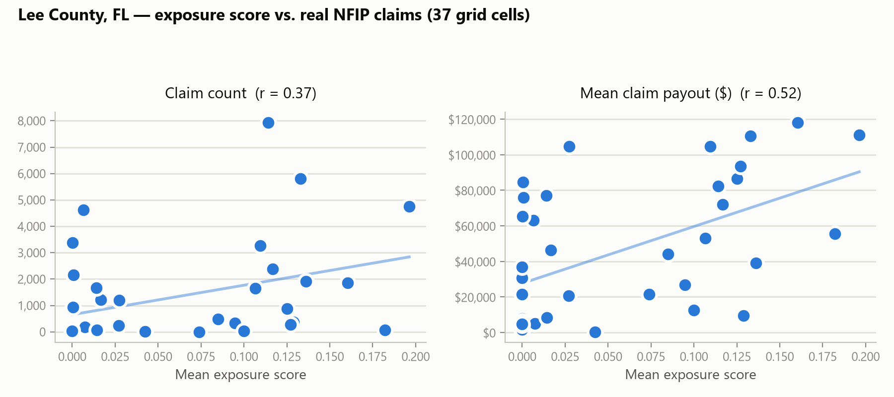

# SurgeExposure: An Open, Reproducible Pipeline for Building-Level Storm-Surge Exposure Scoring, with a Validation Study Against Real NFIP Losses

**Status:** informal research note / technical report produced alongside the
[SurgeExposure](../README.md) open-source project. Not peer-reviewed. The
system description (§2) documents what is actually implemented and
verifiable in this repository; the validation study (§4 onward) is a small,
directional case study — its Limitations section (§8) is not boilerplate,
it is load-bearing, and should be read before trusting any correlation
number in §6.

---

## Abstract

Most publicly visible flood/storm-surge exposure tools are either closed
commercial systems (First Street Foundation, Fathom Global, FEMA's Risk
Rating 2.0) whose scoring methodology and validation are disclosed only
partially, or research prototypes that stop at a demo map without ever
checking the score against outcomes. This report documents SurgeExposure,
an open, fully reproducible pipeline that scores building footprints for
storm-surge and flood exposure using only public data (NOAA SLOSH, NOAA
NWM, Overture Maps) and a transparent, explainable scoring heuristic, and
then — the part most comparable tools skip in public — checks that
heuristic against real losses. Using FEMA's OpenFEMA NFIP claims API, we
compare SurgeExposure's building-level exposure scores against 48,105 real
flood insurance claims for Lee County, FL following Hurricane Ian (2022), at
the 0.1° grid-cell resolution (37 cells) NFIP's privacy rounding permits.
Mean exposure score correlated moderately with both claim frequency
(*r* = 0.37) and mean claim severity (*r* = 0.52) across cells — weaker
than a first, methodologically flawed pass suggested (§5.3). A sensitivity
check restricting claims to Ian's own date window (dropping 40% of raw
claims attributable to unrelated flood events over NFIP's 1978–2026
history, §5.4/§6.1) shows the two hypotheses are not equally trustworthy:
the severity correlation barely moves (*r* = 0.516) but the frequency
correlation weakens by a third (*r* = 0.25) — evidence that part of the
original frequency signal was multi-year claims noise, not something
`exposure_score` actually predicts. A live-data artifact sharpens the read
further: the score's active-flood-extent term is a present-conditions feed
with no historical replay, so it registered nothing for a 2022 storm
queried in 2026, and every score in this study reduces to its storm-surge
term alone. That surge signal is concentrated correctly: roughly 30% of
claims sit in cells with near-zero exposure score, almost all in the
county's inland east, where Hurricane Ian's damage came from
rainfall-driven riverine flooding a storm-surge-only signal was never
going to see. We discuss what a lightweight, explainable, surge-only
heuristic score can and cannot be trusted to predict, and argue the main
lesson is scope, not calibration: the score isn't wrong about surge
exposure, it is silent about a different hazard the same storm also
produced, and its frequency correlation should be trusted considerably
less than its severity correlation.

## 1. Introduction

### 1.1 Motivation

A growing number of open-source and consumer-facing tools — including this
project — compute a per-building "exposure score" or "risk score" from
publicly available hazard layers (storm-surge rasters, flood-zone maps,
inundation extents) without ever checking the score against what actually
happened to real buildings in a real storm. That is a reasonable MVP
shortcut for a demo, but it leaves an open question every such tool
inherits silently: **does the score mean anything?**

At the same time, the systems that *do* validate rigorously — First Street
Foundation's Flood Factor, Fathom Global's Risk Scores, FEMA's own Risk
Rating 2.0 — are closed: proprietary models, licensed data, and validation
claims that are asserted ("peer-reviewed," "validated against historic
flood reports") but not independently reproducible by a reader (§3.1). There
is a gap between "open but unvalidated" and "validated but closed." This
project sits in the first category by default; this report is an attempt to
narrow that gap without pretending to close it — SurgeExposure will not
match a commercial catastrophe model's rigor, but it can be honest, public,
and checked.

### 1.2 Contributions

1. **A fully open, live-data exposure-scoring pipeline** (§2): building
   footprints, storm-surge depth, and active-flood extent, all fetched from
   public APIs with no paid data, no proprietary model, and a scoring
   formula that fits in one line of code.
2. **A validation study** (§4-§7) checking that pipeline's output against
   real NFIP flood-insurance claims for a real, severe storm-surge event,
   using only public data end-to-end — including the FEMA claims API client
   built for this study (`data/nfip.py`).
3. **A documented methodological failure and fix** (§5.3): an early version
   of the validation undercounted its own building coverage by a factor of
   ~7 because of an unordered `LIMIT` query, discovered by inspecting the
   data rather than trusting the first result. We keep this in the report
   because catching it changes what the results in §6 can support, and
   because it is a concrete illustration of why "run the pipeline once and
   report the number" is not sufficient rigor even for a small study.
4. **An honest limitations account** (§8) — most importantly, that any
   result here is an *ecological correlation* at ~0.1° grid resolution, not
   a building-level finding, because NFIP's public claims data is
   privacy-rounded and cannot support anything finer.
5. **A sensitivity check that changes which headline number should be
   trusted** (§5.4/§6.1): restricting claims to Ian's own date window shows
   the frequency correlation (H1) is substantially inflated by unrelated
   multi-year claims noise (r=0.37 → 0.25) while the severity correlation
   (H2) is not (r=0.52 → 0.516) — a second documented bug (a timezone
   mismatch, caught the same way as §5.3's) fixed and covered by a
   regression test along the way.

## 2. System Design: SurgeExposure

This section documents the system being validated, so the validation study
in §4 onward can be read against a concrete implementation rather than a
description of intent. Everything below is implemented in this repository
today; see the linked source files.

### 2.1 Architecture Overview

SurgeExposure is a Python pipeline (`pipeline.py`) fronted by a FastAPI
service (`api/`), with a small set of one-off analysis scripts (`scripts/`)
used to build a static demo and run this validation study. There is no
proprietary model and no licensed dataset anywhere in the stack:

```
data/overture.py        Overture Maps building footprints (live, S3 GeoParquet)
data/storm_surge.py      NOAA SLOSH MOM storm-surge raster (cached once, ~1.6GB)
data/flood_inundation.py NOAA NWM active flood-inundation extent (live, hourly)
data/nfip.py              FEMA OpenFEMA NFIP claims (live) -- built for this study
        |
        v
pipeline.py    -- overlays the three hazard layers into exposure_score / exposure_category
        |
        v
api/main.py (FastAPI)  -- /exposure (GeoJSON), /map (Folium), /geocode, /locations
api/cache.py             -- disk-backed cache, keyed by (bbox, limit), 6h TTL
        |
        v
Leaflet frontend (live) + static GitHub Pages showcase (8 precomputed regions)
```

### 2.2 Data Sources

- **Building footprints — Overture Maps.** Queried live via DuckDB's
  `spatial` and `httpfs` extensions directly against Overture's public
  GeoParquet on S3 (`data/overture.py`). The release version is resolved
  dynamically from Overture's STAC catalog on every query, so the pipeline
  never goes stale against a hardcoded release. Overture's `bbox` struct
  column lets DuckDB push the spatial filter down to the row-group level —
  no local download, no pre-indexing.
- **Storm-surge depth — NOAA SLOSH MOM.** The National Hurricane Center's
  "Maximum of MEOWs" composite storm-surge raster (Texas-to-Maine, 8-bit
  class resolution, ~1.6 GB zipped) is downloaded once and cached locally
  (`data/storm_surge.py`), then sampled at each building's centroid. MOM is
  a *worst-case envelope across many modeled hypothetical storms*, not a
  reconstruction of any specific real event — a distinction that matters
  for how §6's results should be read (a claim asking "did this exact
  storm's surge match the score" would need a different, event-specific
  SLOSH product; see §9).
- **Active flood extent — NOAA NWM.** Live, hourly-updated
  analysis-and-assimilation flood-inundation-mapping polygons from NOAA's
  HydroVIS ArcGIS services (`data/flood_inundation.py`), intersected against
  building footprints. This is a *current-conditions* feed — `get_inundation_extent`
  takes no date parameter and queries whatever is flooded right now — with
  no historical replay capability in this codebase. It can in principle
  register riverine/pluvial flooding as well as coastal, but only if that
  flooding is happening at query time; a fact that matters directly for §6,
  where this study's query (mid-2026) necessarily returned zero active
  extent for a 2022 storm.
- **Ground truth for validation — FEMA NFIP claims.** Built specifically for
  this study (`data/nfip.py`): a client for FEMA's OpenFEMA NFIP claims API
  (v3), described fully in §5.

### 2.3 The Exposure Scoring Model

The scoring formula (`pipeline.py`) is deliberately simple and legible
rather than fit to data:

```
exposure_score = 0.6 * min(surge_ft, 20) / 20 + 0.4 * flood_active
```

mapped to five categories by fixed thresholds: `severe` (≥0.75), `high`
(≥0.5), `moderate` (≥0.25), `low` (>0), `none` (0). The 60/40 weighting and
the thresholds were chosen for explainability — a reader can reconstruct a
building's score from its two inputs without a model card — not calibrated
against any outcome data. That is precisely the gap this report's
validation study probes.

### 2.4 Serving Layer: API, Caching, and Latency

The FastAPI service (`api/main.py`) exposes `/exposure` (GeoJSON) and `/map`
(a server-rendered Folium map), plus `/geocode` (free-text place lookup via
OpenStreetMap Nominatim) and `/locations` (hand-picked demo presets). A
live query is dominated by the Overture GeoParquet scan (~35-40s cold); a
disk-backed cache keyed by `(bbox, limit)` with a 6-hour TTL (`api/cache.py`)
brings a repeat request for the same area down to ~60ms. The TTL is a
deliberate trade: NWM flood extent updates hourly, but this is a
demonstration system, not an operational one, so a few hours of staleness
is an acceptable price for not re-running a 35-40s query on every repeat
visit — an explicit design decision, not an oversight (see the comment in
`api/cache.py`).

### 2.5 Frontend: Interactive Map and Static Showcase

Two frontends exist, deliberately serving different purposes:

1. **The live app** (`api/static/index.html`) — search any address, hit the
   live API, see buildings colored by exposure category on a Leaflet map.
   Meant for local/self-hosted use given the live backend it depends on.
2. **A static GitHub Pages showcase** (`docs/`) — eight hurricane-prone
   coastal regions (South Beach Miami, Fort Myers Beach, French Quarter New
   Orleans, Galveston Seawall, and others) precomputed once
   (`scripts/precompute_regions.py`) into static GeoJSON + a colorized
   surge-depth PNG overlay per region, requiring no backend at all. This is
   the version most viewers actually reach, since it needs no
   infrastructure to host.

### 2.6 Deployment

A Docker image exists (`Dockerfile`, `docker-compose.yml`) for the live
API. The 1.6GB SLOSH raster is fetched lazily into a named volume rather
than baked into the image, so it survives container rebuilds without
bloating image size or requiring it at build time.

### 2.7 Testing Philosophy

Unit tests (`tests/`) validate the scoring/categorization logic and
raster-sampling against synthetic data with all live network calls mocked
via `monkeypatch` — they run fast and offline, and are the tests that ran
green throughout this study's development (§5.3's bug was *not* caught by
these tests, since they test the scoring math, not the live Overture query
behavior — a limitation of the test suite worth naming plainly rather than
implying the tests would have caught it).

## 3. Related Work

### 3.1 Commercial and Institutional Flood Risk Scoring Systems

SurgeExposure is not the first system to compute a property-level flood
risk score. It differs from the systems below primarily in *openness*, not
in modeling sophistication — these are professionally built and, by their
own account, validated at a scale this report cannot match (§8).

| System | Access | Core data | Output | Validation disclosure |
|---|---|---|---|---|
| **SurgeExposure** (this project) | Open source, free, self-hostable | Overture Maps, NOAA SLOSH, NOAA NWM | Building-level 0-1 score, 5 categories | This report — full methodology and code public |
| **First Street Foundation Flood Factor** | Free lookup (consumer), licensed bulk data | USGS DEMs/NED, proprietary flood model, "80+ experts" | Property-level 1-10 score | Asserted peer-reviewed basis; underlying validation code/data not public |
| **FEMA Risk Rating 2.0** | Public methodology PDF; used internally for NFIP pricing | FEMA mapping + commercial catastrophe models, building characteristics | Per-policy premium, not an exposed public "score" | Methodology document public; underlying commercial model internals are not |
| **Fathom Global Risk Scores** | Commercial/institutional (API, portal) | Fathom Global Flood Map (fluvial/pluvial/coastal) | 0-1,000,000 relative risk *or* 0-100 category | Claims peer-reviewed academic basis; specific validation datasets not public |

The pattern across the three commercial/institutional systems: real
scientific grounding is claimed, but the validation itself — the actual
comparison against observed losses, with numbers a reader can check — is
not published in a form an outside reader can reproduce. SurgeExposure is
strictly less sophisticated than any of these (§8), but §4 onward is an
attempt to make the *validation itself*, not just the score, fully public.

### 3.2 Storm-Surge Model Validation

NOAA's SLOSH (Sea, Lake, and Overland Surges from Hurricanes) model, the
surge layer this project uses, has itself been validated against observed
high-water marks in post-storm studies; NOAA reports roughly 20% error for
significant surges, with better accuracy above ~12-13 ft of surge ([NOAA
National Hurricane Center, Storm Surge Unit](https://www.nhc.noaa.gov/surge/ssu.php);
[NOAA National Storm Surge Risk Maps v4](https://www.nhc.noaa.gov/nationalsurge/)).
That validation is against *surge itself* (a physical quantity) — it says
nothing about how well a downstream *exposure heuristic built on top of*
SLOSH tracks *financial loss*, which is the question §4 asks.

### 3.3 NFIP Claims as a Research Resource

FEMA's public release of ~2.5 million redacted NFIP claims (from 1970
onward) opened claims-level flood research to outside researchers ([Journal
of Real Estate Literature overview](https://www.tandfonline.com/doi/abs/10.1080/09277544.2021.1876435)).
Shin, Cocke & Kim (2022) audited NFIP claims hazard fields for Florida
specifically and found the "cause of loss" and event-attribution fields are
frequently incomplete or wrong, requiring correction against independent
storm-track data (HURDAT2) before the claims data can be trusted for hazard
attribution ([*Applied Sciences* 12(7), 3537](https://www.mdpi.com/2076-3417/12/7/3537)).
This study does *not* perform that correction — claims are used as raw
counts/payouts within a county and time period, not attributed to a
specific storm beyond what `dateOfLoss` implies — which is one more reason
to read §6's numbers as directional (§8).

### 3.4 Depth-Damage Functions and Loss Modeling Limits

Wing, Pinter, Bates & Kousky (2020), analyzing ~2 million NFIP claims,
found that **observed flood losses are not a simple monotonic function of
inundation depth** — the standard federal depth-damage curves performed so
poorly that a flat mean damage value predicted losses better than the
curves, and vulnerability varied substantially by geography and building
vintage ([*Nature Communications* 11, 1444](https://doi.org/10.1038/s41467-020-15264-2)).
This matters directly for §2.3's scoring formula: if depth alone is a weak
predictor of loss *magnitude* nationally, a heuristic that leans 60% on
depth should not be assumed to predict severity well either — it has to be
checked, which is exactly what §4-§6 do.

### 3.5 Catastrophe Model Validation Methodology

Public, reproducible comparisons of flood loss models against observed
claims are scarce. The most prominent recent one, a comparison of seven
commercial and federal flood catastrophe models against NFIP claims by
Dusseau, Zobel & Schwalm in the *Journal of Catastrophe Risk and
Resilience* 4(1), was **retracted by its authors on 16 September 2026**
([retraction note](https://journalofcrr.com/Comment/Retraction-Note-04-08-Dusseau-et-al/)).
They cite a data error in one table and a methodological flaw: the
comparison "did not adequately account for the low insurance take-up rate
and the resulting risk selection bias within the NFIP dataset." Its findings
are not relied on here. The stated flaw applies to any study that treats
NFIP claims as ground truth, this one included: claims only exist where
someone bought a policy, and take-up varies across space. §5 therefore
normalizes claim counts by policies in force, and §8 discusses the
selection bias that normalization cannot remove. [TODO: add any surviving
peer-reviewed comparison of loss models against claims.] The scarcity of
public, checkable validation is part of the motivation for this report:
§4-§6 compare a model score against real claims at a much smaller scale
(one county, one event), with every input, script and intermediate table
public.

### 3.6 Spatial Aggregation and the Modifiable Areal Unit Problem

Because NFIP claim coordinates are rounded to 0.1° before release, any
comparison against them is necessarily an *ecological correlation* — a
relationship between area-aggregated quantities, not individual buildings.
This is a textbook instance of the Modifiable Areal Unit Problem (MAUP):
statistical relationships computed over arbitrarily-drawn areal units can
shift, and sometimes reverse, under a different unit size or boundary
placement (Openshaw, 1984; overview in [ScienceDirect: Modifiable Areal Unit
Problem](https://www.sciencedirect.com/topics/earth-and-planetary-sciences/modifiable-areal-unit-problem)).
An ecological correlation is not proof of an individual-level relationship
— this is the single most important methodological caveat for everything in
§6.

## 4. Research Question

> **RQ:** At the 0.1°-grid-cell level, does SurgeExposure's building-level
> `exposure_score` correlate with real NFIP flood-claim outcomes — claim
> frequency and mean claim severity — in Lee County, FL following Hurricane
> Ian?

Two directional hypotheses, tested independently since frequency and
severity are different questions (§3.4 — depth relates to severity in
complex, non-monotonic ways, which gives no a priori reason to expect it
predicts frequency and severity equally well):

- **H1:** mean `exposure_score` per grid cell is positively correlated with
  claim *count* per cell.
- **H2:** mean `exposure_score` per grid cell is positively correlated with
  mean claim *payout* per cell.

## 5. Validation Methodology

**Study area.** Lee County, FL (FEMA county code `12071`) — Fort Myers
Beach, Sanibel, Cape Coral, Fort Myers — struck directly by Hurricane Ian's
storm surge in September 2022.

**Exposure scores.** Computed by the pipeline described in §2.2-§2.3.

**Claims.** Fetched live from FEMA's OpenFEMA NFIP claims API (v3,
`fema.gov/api/open/v3/NfipClaims`), filtered to `state='FL'` and
`countyCode='12071'`, all available years (`data/nfip.py`). A small number
of claims (12 of 48,117, ~0.02%) carry coordinates well outside any
plausible Lee County location (e.g. latitude 29.4°, off the Florida
panhandle) and are dropped as mis-coded records before analysis —
consistent with the data-quality issues Shin et al. (2022) document for
this exact dataset (§3.3).

**Grid-cell join.** Both sides are snapped to a 0.1° lat/lon grid (matching
NFIP's own privacy rounding) and aggregated per cell: mean `exposure_score`
and building count on one side, claim count and mean claim payout
(building + contents, net of the small number of null payout fields) on the
other. Cells are joined with an inner join — only cells with *both* scored
buildings and claims contribute to the correlation.

**5.3 Building sampling — and a bug worth documenting.** An earlier version
of this script queried buildings once, over the whole county bounding box,
with a flat row-count cap (`LIMIT 5000`, no `ORDER BY`). That returned only
5 overlapping grid cells, and inspection showed why: DuckDB's scan order
over Overture's partitioned GeoParquet is not spatially uniform, so the
first 5,000 matching rows all came from one coastal strip, never reaching
the rest of the county. The county's true extent (derived from the claims
data itself, after outlier filtering) contains **~420,000** buildings — too
many to score in full for a validation script — so the fixed version
queries buildings **per claim grid-cell**: a small 0.1°×0.1° Overture query,
capped at 500 buildings, run once for each of the county's claim-bearing
grid cells (37 cells after outlier filtering). This bounds total work while
guaranteeing every claim cell gets a fair chance at building coverage. (See
`scripts/validate_exposure_bins.py` and its git history for the
before/after.)

**Statistic.** Pearson correlation coefficient (`numpy.corrcoef`) between
mean exposure score and each of claim count / mean payout, across
overlapping grid cells. No significance test is reported — see §8 on why
one would be misleading at this *n*.

**Reproducibility.** Every input is public and the pipeline is fully
scripted: `python scripts/validate_exposure_bins.py` reproduces §6 end to
end (requires the cached SLOSH raster and live network access — see the
main [README](../README.md#setup)).

**5.4 Sensitivity check: restricting claims to Ian's own date window.** The
main run above (§6) uses *all* available years of Lee County NFIP claims —
1978 to the query date — not just claims attributable to Ian. That was a
disclosed limitation (§8, original Limitation 5), not a fixed one: any
grid cell's claim count could be inflated by unrelated flood events sharing
that cell, with no way to tell from the headline number alone how much this
mattered. `scripts/validate_exposure_bins.py --ian-window` closes that gap
by re-running the identical pipeline with one change: claims are filtered
to `dateOfLoss` within **2022-08-31 to 2022-12-31** (four weeks before
Ian's 2022-09-28 landfall, through a three-month claims-filing tail) before
aggregation. Building exposure scores are unaffected by this filter --
buildings don't have a "date of loss" -- so any change in the correlations
below isolates the effect of the claims-side date restriction specifically.
Output goes to a separate file (`paper/data/lee_county_grid_ian_window.csv`)
so the original, unrestricted run is preserved for comparison rather than
overwritten.

*A second real bug, caught the same way as the first (§5.3): trust the
run, not the first result.* The first attempt at this filter crashed
outright -- `TypeError: Cannot compare tz-naive and tz-aware datetime-like
objects`. FEMA's live API returns `dateOfLoss` as a timezone-aware
timestamp; the filter's window bounds were naive `Timestamp` objects with
no timezone at all, and pandas correctly refuses to compare the two rather
than silently guessing. Fixed by normalizing every parsed `dateOfLoss` to
UTC and then dropping its timezone before comparison
(`scripts/validate_exposure_bins.py::_restrict_to_ian_window`), and a
regression test now reproduces the exact tz-aware timestamp shape the live
API returns (`tests/test_validate_exposure_bins.py`) so this can't
silently regress. Named here for the same reason §5.3 is: a bug that
would have either crashed obviously (as it did) or, worse, silently
produced a wrong window if the comparison had failed open instead of
raising.

## 6. Results

The per-cell run scored **18,050 buildings** across **37 grid cells**
covering essentially all of Lee County, and matched them against **48,105**
NFIP claims (after outlier filtering, §5) in those same 37 cells — full
county-wide overlap, unlike the 5-cell overlap the flawed first pass
produced (§5.3). Full per-cell data: [`paper/data/lee_county_grid.csv`](data/lee_county_grid.csv).

<picture>
  <source media="(prefers-color-scheme: dark)" srcset="figures/validation-chart-dark.png">
  
</picture>

**H1 (claim frequency):** mean `exposure_score` correlated with claim count
at **r = 0.37** — a real but modest positive relationship, weaker than the
r = 0.20 the flawed 5-cell pass found, and far weaker than that pass's
severity correlation of r = 0.81 (§5.3) suggested the eventual pattern
would be.

**H2 (claim severity):** mean `exposure_score` correlated with mean claim
payout at **r = 0.52** — moderate, and, as with H1, higher than the
frequency correlation but by a much smaller margin than the first pass
implied. Both hypotheses are supported directionally; neither is a strong
relationship.

**The more informative pattern was spatial, not statistical.** Splitting
the county's cells at roughly the coastline (lon ≤ -82.0° vs. lon > -82.0°):
coastal cells average a mean exposure score of **0.081**, inland cells
**0.039** — the score correctly recognizes the coast as more exposed, by a
factor of ~2. But claim volume does not track that split: coastal cells
account for 22,350 claims, inland cells **25,755** — Lee County's *interior*
generated more claims than its scored-as-riskier coastline. Roughly **30%
of all claims (14,605 of 48,105) sit in cells with a mean exposure score
below 0.02** — near the pipeline's effective floor — concentrated in the
county's eastern cells (grid longitude -81.6 to -81.9, inland Fort Myers
and Lehigh Acres). The highest-scoring cell in the dataset (26.4°N,
-81.9°W, score 0.196) sits at the coastal/inland boundary and does carry
substantial claims (4,763) — but several purely inland cells (e.g. 26.6°N,
-82.0°W: score 0.0065, 4,619 claims; 26.6°N, -81.9°W: score 0.0002, 3,375
claims) carry comparable claim volume with a score indistinguishable from
zero.

**One more fact changes how to read all of the above: the active-flood term
contributed nothing in this run.** Querying `data/flood_inundation.py`'s
live NWM feed for the full county extent, in mid-2026, returns zero active
inundation polygons — expected, since Lee County is not presently flooding
and the feed has no historical replay capability (§2.2). That means
`flood_active` was `False` for every one of the 18,050 buildings scored
here, and every `exposure_score` in this study reduces exactly to its
surge term: `0.6 * min(surge_ft, 20) / 20`. §6's correlations are therefore
correlations against **SLOSH surge depth alone**, not against the full
60/40 formula — the 40% flood-extent weight was structurally inert for
this entire validation, through no fault of the buildings scored.

**6.1 Sensitivity check: restricting claims to Ian's own date window (§5.4).**
Filtering `dateOfLoss` to 2022-08-31–2022-12-31 dropped **19,290 of 48,117
claims (40%)** — a far larger share than the disclosed-but-unquantified
Limitation 5 in the original draft implied. Three grid cells lost all
their claims entirely and dropped out (37 → 34 overlapping cells); the
remaining **16,550 scored buildings** matched against **28,827** real,
Ian-window-only claims. The two hypotheses did *not* respond the same way:

| | Unrestricted (all years, §6) | Ian window only (§6.1) | Change |
|---|---|---|---|
| Claims used | 48,105 | 28,827 | -40% |
| Grid cells | 37 | 34 | -3 |
| H1: r(score, claim count) | 0.37 | **0.25** | -0.12 |
| H2: r(score, mean payout) | 0.52 | **0.516** | -0.004, essentially unchanged |

**H1's correlation is not robust to this check; H2's is.** Restricting to
claims plausibly caused by Ian weakens the frequency relationship by about
a third (0.37 → 0.25) while leaving the severity relationship untouched.
The natural read: **large-dollar claims cluster tightly with real,
identifiable storm events almost regardless of which storm** (a
catastrophic payout in Lee County is unlikely to come from routine,
non-storm flooding, so restricting to Ian's window removes few *severe*
claims specifically), while a substantial share of *routine, low-dollar*
claims recorded over 1978–2026 are unrelated background noise that happens
to weakly echo the same coastal-vs-inland geography the score also
encodes — inflating H1's unrestricted correlation without reflecting
anything about Ian, or about `exposure_score`'s real skill, specifically.
Full per-cell data: [`paper/data/lee_county_grid_ian_window.csv`](data/lee_county_grid_ian_window.csv).

## 7. Discussion

Both hypotheses hold directionally (§6), but the moderate correlations
understate the more useful finding: **`exposure_score` is not miscalibrated
so much as, for this validation, it was only ever able to measure one of
its two inputs.** The active-flood term was inert throughout (§6) because
it is a real-time feed with no way to look back at a 2022 storm from 2026
(§2.2) — so what this study actually validated is SLOSH surge depth against
real losses, not the blended score the tool ships. Hurricane Ian produced
catastrophic rainfall well beyond its surge zone, and Lee County's inland
cells — scored near zero by a surge-only signal, correctly, since surge
does not reach that far inland — nonetheless produced as many claims as the
coast. A correlation computed across *all* 37 cells necessarily blends a
real, positive within-hazard-scope relationship (surge score does track
surge-zone claims reasonably, per the top-scoring cells) with a population
of inland cells surge depth was never going to explain, which drags the
overall *r* toward the moderate values in §6 rather than the strong ones a
surge-scoped comparison alone might show.

This reframes what the 60/40 surge/flood weighting question (§2.3, §1.2)
even is. The original question — "should surge count for more or less than
flood-extent within the score" — presupposes both terms were actually
contributing during this validation; §6 shows the flood-extent term simply
wasn't. The gap this study surfaces isn't a *reweighting* of surge vs.
active-flood-extent, it's that the active-flood term needs a
**historical/event-specific data source** (§9) before a validation like
this one can say anything about it at all — and separately, that neither
input, even fixed, obviously covers rainfall-driven riverine flooding the
way the inland-claims pattern suggests it should. Wing et al.'s finding
that depth alone predicts loss magnitude poorly (§3.4) is consistent with,
though not identical to, this: here the deeper problem precedes depth
entirely — for roughly a third of the county's claims, the model's depth input is simply
inapplicable, not merely imprecise.

Practically, for SurgeExposure specifically, this argues against reweighting
`SURGE_WEIGHT`/`FLOOD_WEIGHT` as the next step (§1.2's original framing) and
for scope-labeling instead: the tool should describe itself as a
*storm-surge* exposure score, not a general flood exposure score, until a
riverine/pluvial hazard layer is added (§9). That is a smaller, more honest
change than recalibrating weights that were never trying to model the
hazard that actually explains a third of the county's real losses.

**§6.1's date-window check adds a second, independent caveat on top of the
scope problem above: H1's r=0.37 headline number was itself partly an
artifact of comparing against 44 years of undifferentiated claims, not
just Ian's.** That the severity correlation (H2) barely moved under the
same restriction (0.52 → 0.516) while the frequency correlation dropped by
a third is itself informative, not just a robustness footnote: it suggests
`exposure_score` may be doing real work distinguishing which cells see
*catastrophic* losses, while its apparent ability to predict *how many*
claims a cell sees was inflated by claims that have nothing to do with
storm surge at all. A reader taking one number from this report as
`exposure_score`'s "real" skill should treat H2's r≈0.52 as the more
trustworthy of the two, and H1's r=0.25–0.37 as bracketing a genuinely
uncertain, window-dependent estimate rather than picking whichever end of
that range is more flattering.

## 8. Limitations

However §6 turns out, the following hold regardless and bound how much
weight these results can carry:

1. **Ecological correlation, not individual-level.** Per §3.6 (MAUP), a
   cell-level relationship does not establish that any individual exposed
   building was more or less likely to claim or to claim big. Reversal at a
   different aggregation size is possible in principle and untested here.
2. **Small *n*.** The number of overlapping grid cells is on the order of
   tens, not hundreds — nowhere near enough for a credible significance
   test, let alone for reweighting a production scoring model. Every
   correlation reported is a hint, not a finding.
3. **Spatial autocorrelation.** Neighboring 0.1° cells are not independent
   observations (adjacent coastal cells share storm track, elevation, and
   construction era) — the effective sample size for inference is smaller
   than the raw cell count, which a naive Pearson *r* does not account for.
4. **Single county, single event.** Lee County under Hurricane Ian is one
   storm, one coastline, one building stock. Nothing here generalizes to a
   different storm, coastline type, or state without independent
   replication.
5. **Claims data quality, now quantified rather than only disclosed.** Per
   Shin et al. (2022, §3.3), NFIP hazard-attribution fields for Florida are
   known to be incomplete/incorrect in places; this study did not perform
   their full correction procedure. What §6.1 adds: restricting claims to
   Ian's own date window drops 40% of raw claims and weakens H1's
   correlation from r=0.37 to r=0.25, while H2 barely moves (0.52 → 0.516)
   — so the unrelated-event contamination this limitation describes turns
   out to matter substantially for claim frequency and hardly at all for
   claim severity, not equally for both as the original draft of this
   limitation implied.
6. **No control for building value, age, or elevation.** Wing et al. (2020,
   §3.4) found these materially affect loss given depth. `exposure_score`
   doesn't model them, and neither does this validation.
7. **SLOSH MOM is a worst-case envelope, not an Ian-specific reconstruction**
   (§2.2). The surge input to `exposure_score` was never intended to
   reproduce this specific storm's actual water levels — a genuinely
   Ian-specific validation would need an event-specific SLOSH/P-Surge run,
   which is future work (§9), not what this study used.
8. **This system is far less sophisticated than the commercial systems in
   §3.1**, which incorporate elevation, construction type, and
   decades of multi-hazard modeling. This report does not claim
   SurgeExposure's heuristic competes with those systems — only that,
   unlike them, its validation attempt is fully public.

## 9. Future Work

- **Give the active-flood term a historical/event-specific data source**
  (e.g. NOAA NWM's retrospective streamflow archive) instead of only the
  live feed — §6 found it was completely inert for this study, which used
  today's conditions to score a 2022 storm.
- **Add or confirm riverine/pluvial coverage** once the term above is
  fixed — §7 argues this, not reweighting `SURGE_WEIGHT`/`FLOOD_WEIGHT`, is
  what §6's inland-claims pattern actually calls for.
- ~~Replicate across multiple counties/coastlines~~ — partially done (§9.1):
  a companion project re-ran this exact methodology across all 8 regions
  it covers, using this pipeline's own precomputed scores. H2 held up and
  strengthened; H1 did not. Replication across multiple *storm events*
  (as opposed to multiple *places*) remains open, and no reweighting of
  `SURGE_WEIGHT`/`FLOOD_WEIGHT` in `pipeline.py` has been done on the
  strength of this result.
- ~~Restrict claims to a tight post-Ian date window~~ — done (§5.4, §6.1):
  H1 is window-sensitive (r=0.37 unrestricted vs. 0.25 restricted), H2
  is not (0.52 vs. 0.516). What's still open: sweep the window's *width*
  (this study picked one four-week-before/three-month-after window
  without testing sensitivity to that specific choice) to check whether
  H1's correlation keeps drifting as the window tightens further or has
  already stabilized.
- Use an event-specific SLOSH/P-Surge advisory run for Ian instead of the
  MOM worst-case composite (Limitation 7), for a genuinely storm-specific
  comparison.
- Incorporate `ratedFloodZone` and elevation as additional predictors
  alongside surge depth, informed by Wing et al.'s finding that depth alone
  is a weak severity predictor.
- If a future collaboration secures access to non-redacted (building-level)
  claims coordinates under a FEMA data-use agreement, redo this as an
  actual per-building join instead of a grid-cell ecological correlation.

### 9.1 Update (September 2026): multi-region replication

A companion project, [surge-exposure-ml](https://github.com/DBishal13/surge-exposure-ml),
independently fetched real NFIP claims for all 8 regions this pipeline's
public demo dataset covers (140,732 claims total, vs. this study's 48,105
for Lee County alone) and re-ran this paper's exact grid-cell methodology
(§5) against them — the same 0.1° snap-to-grid, the same per-cell
aggregation, the same Pearson correlation — without re-scoring a single
building: it reused this pipeline's own precomputed `exposure_score`
values for the 7,717 buildings in its demo dataset exactly as this project
produced them.

**H2 (severity) held up, and strengthened, outside Lee County**: r = 0.52
(Lee County) → r = 0.711 across all 13 cells in the wider dataset, rising
to r = 0.805 with one outlier cell excluded. A heuristic that only worked
by Lee-County-specific coincidence would be expected to weaken outside it,
not strengthen — this is evidence against that reading.

**H1 (frequency) did not hold up — it became sign-unstable**: r = -0.113
across all 13 cells, flipping to r = +0.169 with a single cell excluded.
Consistent with, not contradicting, this paper's own §6.1 finding that
H1's headline number was partly a date-window artifact: at wider
geographic scope, the same fragility shows up as sign instability rather
than a smaller magnitude.

**A concrete instance of this paper's own abstract limitation**: one
cell — French Quarter, New Orleans — scores `exposure_score = 0.000`
(the model's flat claim of *zero* storm-surge exposure) while carrying
7,931 real NFIP claims, the single highest claim count of any cell in the
8-region dataset, averaging $64,576 in building-only payouts per claim.
This is exactly the "~30% of claims from inland, rainfall-driven flooding
a surge-only signal was never going to see" problem named in this paper's
abstract (§1.1) — no longer an abstract caveat, but a specific, named,
quantified place.

A follow-up check in that project asked whether a trained model (rather
than this heuristic) would catch that blind spot in advance, using honest
out-of-fold cross-validation rather than a model fit on the same data it's
evaluated against. It did, partially — but not uniformly: at least one
region (Clearwater Beach) is a case where the simple heuristic beats a
properly cross-validated learned model. The resulting design principle —
report both, and treat large disagreement between them as the signal
worth surfacing, rather than picking a permanent winner — is now live in
[surge-exposure-agent](https://github.com/DBishal13/surge-exposure-agent)'s
`compare_risk_estimates` tool. Full write-up:
[surge-exposure-ml/analysis/ANALYSIS.md](https://github.com/DBishal13/surge-exposure-ml/blob/main/analysis/ANALYSIS.md).

One scope note this paper's own standards call for stating plainly: this
replication reused precomputed scores for a fixed, small demo dataset
rather than re-running `run_exposure_pipeline` freshly per claim cell the
way §5's own Lee County methodology did — so it extends this study's
geographic *breadth*, not its per-cell building *density*, and inherits
whatever selection effects exist in how those 8 regions' demo buildings
were originally sampled.

## 10. Conclusion

SurgeExposure's `exposure_score` correlates with real Hurricane Ian NFIP
claims at a moderate level — *r* = 0.52 for severity, robust to a
date-window sensitivity check (§6.1); *r* = 0.37 for frequency,
unrestricted, dropping to *r* = 0.25 once claims are restricted to Ian's
own window (§6.1) — enough to say the heuristic is not meaningless, not
enough to call it validated, and enough to say plainly that its two
headline correlations do not deserve equal trust. The more useful finding
was not the correlation strength but its shape, in two separate ways: the
storm-surge signal this study actually measured (the active-flood term was
inert throughout, §6) tracks claims reasonably within the surge zone it
models and says almost nothing about the roughly third of Lee County's
claims that came from inland, rainfall-driven flooding outside that zone;
and separately, a large share of what looked like frequency signal in the
unrestricted number was multi-year claims noise rather than anything
`exposure_score` actually predicts (§6.1). The honest fix implied by this
report is not tuning the existing 60/40 weighting (§2.3) but three more
specific things: giving the active-flood term a historical data source so
it can contribute at all in a study like this one, confirming or extending
its hazard coverage to rainfall-driven flooding once it does (§9), and
reporting the frequency correlation as a window-dependent range (0.25–0.37)
rather than a single flattering number going forward. This report's
central methodological point survives the specific numbers either way: a
small, fully public validation — published data, published code, published
bugs (§5.3, §5.4) and all — is more useful than a larger,
asserted-but-unverifiable one, precisely because a reader can find the same
third-of-claims pattern and the same date-window sensitivity in
[`paper/data/lee_county_grid.csv`](data/lee_county_grid.csv) and
[`paper/data/lee_county_grid_ian_window.csv`](data/lee_county_grid_ian_window.csv)
that this report found, and does not have to take the report's word for it.

## References

- Dusseau, D., Zobel, Z., & Schwalm, C.R. (2026). Validation and Comparison
  of U.S. Loss Estimates from Catastrophe Flood Models. *Journal of
  Catastrophe Risk and Resilience*, 4(1). **Retracted 16 September 2026**;
  cited only to note the retraction (§3.5).
  https://journalofcrr.com/research/04-01-dusseau-et-al/
- FEMA. National Flood Insurance Program Risk Rating 2.0: Methodology and
  Data Sources.
  https://www.fema.gov/sites/default/files/documents/FEMA_Risk-Rating-2.0_Methodology-and-Data-Appendix__01-22.pdf
- First Street Foundation. Flood Model Methodology — Calculating
  property-level risk.
  https://help.firststreet.org/hc/en-us/articles/1500000359741-Flood-Model-Methodology-Calculating-property-level-risk
- Fathom Global. Risk Scores — flood risk metrics.
  https://www.fathom.global/product/global-flood-map/risk-scores/
- NOAA National Hurricane Center. Storm Surge Unit — model verification and
  post-storm analysis. https://www.nhc.noaa.gov/surge/ssu.php
- NOAA National Hurricane Center. National Storm Surge Risk Maps, Version 4.
  https://www.nhc.noaa.gov/nationalsurge/
- Openshaw, S. (1984). *The Modifiable Areal Unit Problem*. Concepts and
  Techniques in Modern Geography 38. Geo Books.
- Shin, D.W., Cocke, S., & Kim, B.-M. (2022). A Systematic Revision of the
  NFIP Claims Hazard Data in Florida for Flood Risk Assessment. *Applied
  Sciences*, 12(7), 3537. https://www.mdpi.com/2076-3417/12/7/3537
- Wing, O.E.J., Pinter, N., Bates, P.D., & Kousky, C. (2020). New insights
  into US flood vulnerability revealed from flood insurance big data.
  *Nature Communications*, 11, 1444.
  https://doi.org/10.1038/s41467-020-15264-2

---

*Part of the [SurgeExposure](../README.md) project. Code, data pipeline, and
this document are all public — see the repository root for setup
instructions.*
